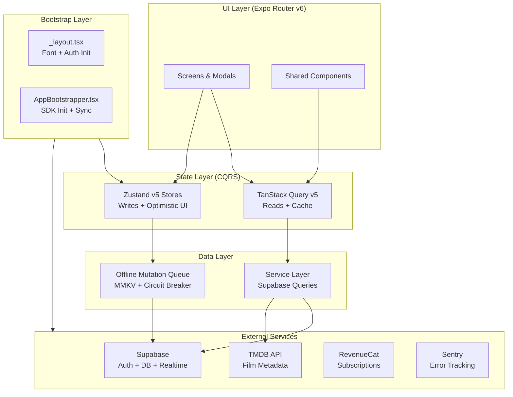
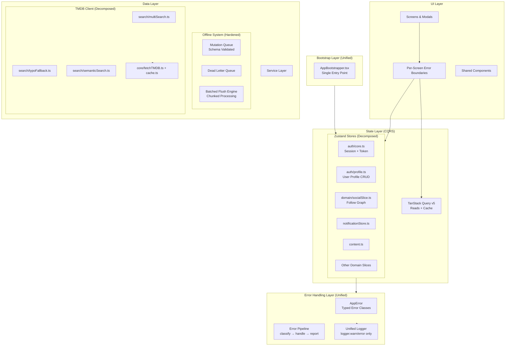
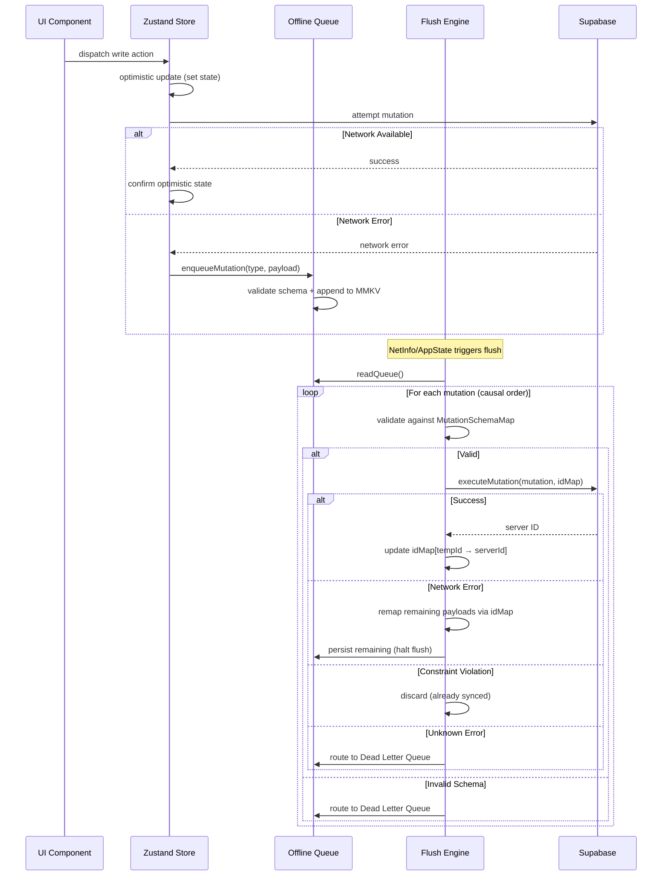
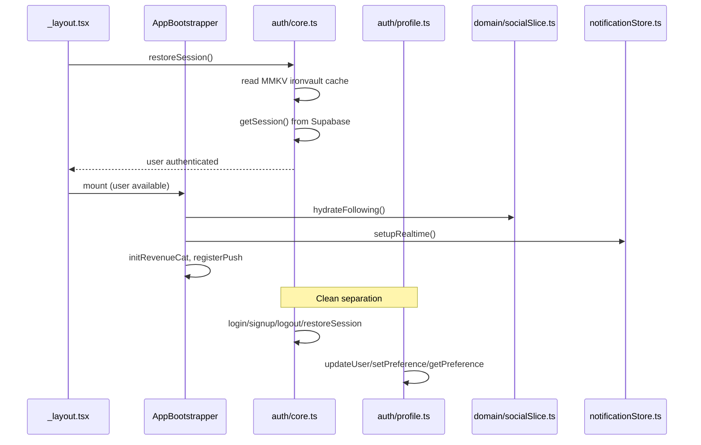

# Design Document: Code Review & Elevation Plan

## Overview

This document defines a comprehensive, prioritized elevation plan for the ReelHouse Mobile codebase — a cinema-themed film-logging social platform built on Expo 54, React 19.1, React Native 0.81, and TypeScript strict mode. The architecture uses a CQRS pattern (TanStack Query for reads, Zustand for writes) with an offline-first mutation queue backed by MMKV.

The codebase is production-grade with sophisticated patterns (optimistic updates with rollback, causal ordering in offline queue, compound cursor pagination). This plan targets specific architectural debt, performance bottlenecks, reliability gaps, and testing deficiencies identified across 10 quality dimensions. Each elevation item is tagged by priority (Critical → High → Medium → Low) and the primary dimension it addresses.

The plan preserves what works — the CQRS separation, the offline-first architecture, the Nitrate Noir design system — while surgically improving module boundaries, error handling consistency, test coverage, and performance characteristics.

## Architecture

### Current State



### Proposed Architecture Improvements



## Sequence Diagrams

### Offline Mutation Lifecycle



### Auth Store Decomposition Flow



## Components and Interfaces

### Component 1: Unified Error Handling Layer

**Purpose**: Replace the fragmented error handling (logger.warn, console.warn, reelToast.error, Sentry) with a single pipeline.

**Interface**:
```typescript
// src/utils/errors/AppError.ts
type ErrorSeverity = 'low' | 'medium' | 'high' | 'critical';
type ErrorCategory = 'network' | 'auth' | 'validation' | 'timeout' | 'storage' | 'unknown';

interface AppError {
  category: ErrorCategory;
  severity: ErrorSeverity;
  message: string;
  originalError?: unknown;
  context?: Record<string, unknown>;
  recoverable: boolean;
}

// src/utils/errors/errorPipeline.ts
interface ErrorPipeline {
  /** Classify raw error into AppError */
  classify(error: unknown, context?: string): AppError;
  /** Handle error: log + toast + Sentry based on severity */
  handle(error: AppError): void;
  /** Wrap async operations with classification + handling */
  withErrorHandling<T>(
    operation: () => Promise<T>,
    context: string,
    options?: { silent?: boolean; fallback?: T }
  ): Promise<T>;
}
```

**Responsibilities**:
- Classify all raw errors into typed AppError instances
- Route errors to appropriate handlers (toast for user-visible, Sentry for production, logger for dev)
- Eliminate all `if (__DEV__) console.warn(...)` patterns
- Provide `withErrorHandling` wrapper for consistent async error handling

### Component 2: Auth Store (Decomposed)

**Purpose**: Split the 400+ line auth.ts monolith into focused modules.

**Interface**:
```typescript
// src/stores/auth/core.ts — Session lifecycle only
interface AuthCoreState {
  user: User | null;
  isAuthenticated: boolean;
  loading: boolean;
  login: (email: string, password: string) => Promise<void>;
  signup: (email: string, password: string, username: string, persona?: string) => Promise<{ needsConfirmation: boolean }>;
  logout: () => Promise<void>;
  restoreSession: () => Promise<void>;
}

// src/stores/auth/profile.ts — Profile mutations
interface AuthProfileState {
  updateUser: (updates: Partial<User>) => Promise<void>;
  setPreference: (key: string, value: unknown) => Promise<void>;
  getPreference: (key: string, fallback?: unknown) => unknown;
}

// src/stores/auth/index.ts — Barrel export preserving API
export { useAuthStore } from './core';
export { useProfileActions } from './profile';
```

**Responsibilities**:
- `auth/core.ts`: Session management (login, signup, logout, restoreSession, MMKV cache)
- `auth/profile.ts`: Profile CRUD (updateUser, setPreference, getPreference)
- Follow/unfollow already extracted to `domain/socialSlice.ts` — remove dead code from auth.ts
- Throttle utilities extracted to shared `utils/throttle.ts`

### Component 3: TMDB Search (Decomposed)

**Purpose**: Break the 200+ line `tmdb.search()` monolith into composable search strategies.

**Interface**:
```typescript
// src/lib/tmdb/core.ts
interface TMDBCore {
  fetchTMDB<T>(path: string, fallback?: T | null): Promise<T | null>;
  cacheGet(key: string): unknown | undefined;
  cacheSet(key: string, data: unknown): void;
}

// src/lib/tmdb/search/multiSearch.ts
interface MultiSearchStrategy {
  execute(query: string, page: number): Promise<TMDBSearchResponse>;
}

// src/lib/tmdb/search/typoFallback.ts
interface TypoFallbackStrategy {
  execute(query: string): Promise<TMDBSearchResponse | null>;
}

// src/lib/tmdb/search/semanticSearch.ts
interface SemanticSearchStrategy {
  execute(query: string): Promise<TMDBSearchResponse | null>;
}

// src/lib/tmdb/search/index.ts — Orchestrator
interface TMDBSearchOrchestrator {
  /** Tier 1 → Tier 2 → Tier 3 with early return */
  search(query: string, page?: number): Promise<TMDBSearchResponse>;
}
```

**Responsibilities**:
- `core.ts`: fetchTMDB, LRU cache, inflight dedup (unchanged logic, extracted)
- `multiSearch.ts`: Tier 1 omni-search with person/movie sort + dedup
- `typoFallback.ts`: Tier 2 word-dropping fallback
- `semanticSearch.ts`: Tier 3 keyword-based discover
- `index.ts`: Orchestrates tiers with early-return on success

### Component 4: Per-Screen Error Boundaries

**Purpose**: Add granular error boundaries per screen/feature to prevent single-component crashes from taking down the entire app.

**Interface**:
```typescript
// src/components/ScreenErrorBoundary.tsx
interface ScreenErrorBoundaryProps {
  children: React.ReactNode;
  screenName: string;
  fallback?: React.ReactNode;
  onError?: (error: Error, info: React.ErrorInfo) => void;
}

// Usage in screens:
// <ScreenErrorBoundary screenName="film-detail">
//   <FilmDetailContent />
// </ScreenErrorBoundary>
```

**Responsibilities**:
- Catch render errors in individual screens without crashing the navigator
- Report to Sentry with screen-specific context
- Show a themed retry UI (consistent with Nitrate Noir)
- Root ErrorBoundary remains as last-resort SafeMode

### Component 5: Bootstrap Consolidation

**Purpose**: Eliminate duplicated initialization between `_layout.tsx` and `AppBootstrapper.tsx`.

**Interface**:
```typescript
// src/providers/AppBootstrapper.tsx — Single source of truth for:
interface BootstrapResponsibilities {
  // Auth lifecycle (already handled)
  authStateListener: () => void;
  // SDK initialization (RevenueCat, Sentry, Push)
  sdkInit: (user: User) => Promise<void>;
  // Realtime subscriptions
  realtimeSetup: (user: User) => void;
  // Background sync (NetInfo, AppState)
  syncEngines: () => () => void;
  // OTA updates
  otaCheck: () => void;
}

// _layout.tsx — ONLY responsible for:
interface LayoutResponsibilities {
  fontLoading: boolean;
  splashScreen: boolean;
  routerConfig: StackScreens;
  deepLinkHandling: (url: string) => void;
}
```

**Responsibilities**:
- Remove NetInfo/AppState listeners from `_layout.tsx` (already in AppBootstrapper)
- Remove `flushOfflineQueue` calls from `_layout.tsx`
- Remove SDK initialization from `_layout.tsx` `prepare()` function
- `_layout.tsx` only: fonts, splash, router, deep links
- `AppBootstrapper.tsx` only: auth, SDKs, realtime, sync, OTA

## Data Models

### Unified Error Type

```typescript
// src/types/errors.ts
interface AppError {
  id: string;                    // Unique error instance ID for correlation
  category: ErrorCategory;       // network | auth | validation | timeout | storage | unknown
  severity: ErrorSeverity;       // low | medium | high | critical
  message: string;               // Human-readable message
  technicalMessage?: string;     // Developer-facing detail
  originalError?: unknown;       // Preserved original for debugging
  context?: Record<string, unknown>; // Arbitrary metadata
  recoverable: boolean;          // Can the user retry?
  timestamp: number;             // When it occurred
}

type ErrorCategory = 'network' | 'auth' | 'validation' | 'timeout' | 'storage' | 'unknown';
type ErrorSeverity = 'low' | 'medium' | 'high' | 'critical';
```

**Validation Rules**:
- `category` must be one of the defined categories
- `severity` determines handling: low → logger only, medium → toast, high → toast + Sentry, critical → Sentry + potential SafeMode
- `recoverable: true` means UI should show retry affordance

### Offline Queue Entry (Extended)

```typescript
// src/types/mutations.ts (existing, extended)
interface QueuedMutation {
  id: string;
  type: MutationType;
  payload: Record<string, unknown>;
  timestamp: number;
  retryCount: number;           // NEW: Track retry attempts
  lastAttempt?: number;         // NEW: When was last flush attempt
  schemaVersion: number;        // NEW: For migration safety
}
```

**Validation Rules**:
- `retryCount` max 5 before routing to dead-letter
- `schemaVersion` must match current MutationSchemaMap version
- `timestamp` older than 24h triggers pruning (existing behavior, now explicit)

## Algorithmic Pseudocode

### Auth Store Decomposition Algorithm

```typescript
// Step-by-step migration preserving backward compatibility

// PHASE 1: Extract profile actions (no breaking changes)
// auth/profile.ts reads from useAuthStore, writes via useAuthStore.setState
function extractProfileActions(): void {
  // Precondition: auth.ts exports useAuthStore
  // Postcondition: profile.ts can update user without circular imports
  
  // Move: updateUser, setPreference, getPreference
  // Keep: user state in core store (single source of truth)
  // Pattern: profile.ts imports useAuthStore and calls setState externally
}

// PHASE 2: Remove dead social code from auth.ts
function removeSocialCode(): void {
  // Precondition: socialSlice.ts is fully operational (it is)
  // Postcondition: auth.ts no longer exports followUser/unfollowUser
  
  // Remove: followUser, unfollowUser, _usernameIdCache, resolveUsernameToId
  // Remove: _persistFollowingToCache (moved to socialSlice)
  // Keep: hydrateFollowing import in _layout.tsx (redirect to socialSlice)
}

// PHASE 3: Create barrel export for API compatibility
// auth/index.ts re-exports everything so existing imports don't break
```

### Error Pipeline Classification Algorithm

```typescript
// src/utils/errors/errorPipeline.ts

function classify(error: unknown, context?: string): AppError {
  // INPUT: raw error from catch block + optional context string
  // OUTPUT: typed AppError with category, severity, recoverability

  // STEP 1: Extract message and metadata
  const msg = extractMessage(error);
  const status = extractStatus(error);
  const code = extractCode(error);

  // STEP 2: Classify by category (priority order)
  if (isNetworkError(error)) {
    return { category: 'network', severity: 'medium', recoverable: true, message: 'Connection lost. Changes saved offline.' };
  }
  if (status === 401 || status === 403 || msg.includes('JWT')) {
    return { category: 'auth', severity: 'high', recoverable: false, message: 'Session expired. Please log in again.' };
  }
  if (msg.includes('timeout') || msg.includes('aborted')) {
    return { category: 'timeout', severity: 'low', recoverable: true, message: 'Request timed out. Retrying...' };
  }
  if (msg.includes('invalid') || msg.includes('required') || code === '23502') {
    return { category: 'validation', severity: 'medium', recoverable: false, message: 'Invalid data. Please check your input.' };
  }
  return { category: 'unknown', severity: 'high', recoverable: false, message: 'Something went wrong.' };
}

// Postcondition: Every error is classified — no unhandled category
// Postcondition: Network errors are always recoverable
// Postcondition: Auth errors trigger re-authentication flow
```

### TMDB Search Decomposition Algorithm

```typescript
// src/lib/tmdb/search/index.ts

async function search(query: string, page: number = 1): Promise<TMDBSearchResponse> {
  // INPUT: user query string, page number
  // OUTPUT: TMDBSearchResponse with results + searchType + matchedContext
  // PRECONDITION: query.length > 0
  // POSTCONDITION: searchType is one of 'exact' | 'person' | 'typo' | 'semantic' | 'failed'

  // TIER 1: Multi-search (direct match)
  const tier1 = await multiSearch.execute(query, page);
  if (tier1.results.length > 0 || page > 1) {
    return tier1; // searchType: 'exact' | 'person'
  }

  // TIER 2: Typo fallback (word-dropping)
  const tier2 = await typoFallback.execute(query);
  if (tier2 !== null) {
    return tier2; // searchType: 'typo'
  }

  // TIER 3: Semantic search (keyword-based discover)
  const tier3 = await semanticSearch.execute(query);
  if (tier3 !== null) {
    return tier3; // searchType: 'semantic'
  }

  return { results: [], searchType: 'failed' };
}

// INVARIANT: Each tier is independent and stateless
// INVARIANT: Tiers execute sequentially with early return on success
// INVARIANT: All tiers route through fetchTMDB (retry + cache + dedup)
```

### Offline Queue Flush — Batched Processing Algorithm

```typescript
// src/utils/offlineQueue.ts — Enhanced flush with chunked processing

async function flushOfflineQueue(): Promise<void> {
  // PRECONDITION: isFlushing === false (mutex guard)
  // POSTCONDITION: All processable mutations are executed or routed to dead-letter
  // INVARIANT: Causal ordering is preserved (idMap propagation)
  // INVARIANT: Network failure halts flush to preserve dependent mutations

  const BATCH_SIZE = 50; // Process in chunks to prevent UI thread starvation
  let queue = readQueue();
  queue = pruneStale(queue, STALE_THRESHOLD_MS);

  if (queue.length === 0) return;

  const idMap: Record<string, string> = {};
  const remaining: QueuedMutation[] = [];
  const deadLetter: QueuedMutation[] = [];
  let processedCount = 0;

  for (let i = 0; i < queue.length; i++) {
    // YIELD to UI thread every BATCH_SIZE mutations
    if (processedCount > 0 && processedCount % BATCH_SIZE === 0) {
      await yieldToMainThread(); // InteractionManager.runAfterInteractions
    }

    const mutation = queue[i];

    // Validate schema
    const schema = MutationSchemaMap[mutation.type];
    if (schema && !schema.safeParse(mutation.payload).success) {
      deadLetter.push(mutation);
      continue;
    }

    // Check retry limit
    if ((mutation.retryCount ?? 0) >= MAX_RETRIES) {
      deadLetter.push(mutation);
      continue;
    }

    try {
      const result = await executeMutation(mutation, idMap);
      if (result.fakeId && result.newId) {
        idMap[result.fakeId] = result.newId;
      }
      processedCount++;
    } catch (error) {
      if (isNetworkError(error)) {
        // Remap remaining payloads and halt
        for (let j = i; j < queue.length; j++) {
          queue[j].payload = applyIdMapToPayload(queue[j].payload, idMap);
          queue[j].retryCount = (queue[j].retryCount ?? 0) + 1;
        }
        remaining.push(...queue.slice(i));
        break;
      } else if (isConstraintViolation(error)) {
        continue; // Already synced — discard
      } else {
        deadLetter.push(mutation);
      }
    }
  }

  writeQueue(remaining);
  appendDeadLetter(deadLetter);

  // Notify user if any succeeded
  if (processedCount > 0) {
    reelToast(`Archive updated with ${processedCount} offline action(s).`);
  }
  // Notify user if mutations are permanently failed
  if (deadLetter.length > 0) {
    reelToast.error(`${deadLetter.length} action(s) couldn't be synced.`);
  }
}

// POSTCONDITION: remaining.length + deadLetter.length + processedCount === queue.length
// POSTCONDITION: No mutation is lost — it's either processed, remaining, or dead-lettered
```

## Key Functions with Formal Specifications

### Function 1: classify() — Error Classification

```typescript
function classify(error: unknown, context?: string): AppError
```

**Preconditions:**
- `error` parameter is provided (may be any type including undefined)
- Function is pure — no side effects

**Postconditions:**
- Always returns a valid AppError (never throws)
- `result.category` is one of the defined ErrorCategory values
- `result.severity` is one of the defined ErrorSeverity values
- Network errors always have `recoverable: true`
- Auth errors always have `severity: 'high'`
- Unknown errors default to `severity: 'high'` (fail safe, not silent)

**Loop Invariants:** N/A (no loops)

---

### Function 2: flushOfflineQueue() — Queue Processing

```typescript
async function flushOfflineQueue(): Promise<void>
```

**Preconditions:**
- `isFlushing === false` (enforced by mutex, returns early if true)
- MMKV storage is accessible

**Postconditions:**
- `isFlushing === false` after completion (finally block)
- All mutations are accounted for: `processed + remaining + deadLetter === initialQueue.length`
- `remaining` mutations have updated `retryCount`
- `idMap` transformations are applied to all remaining payloads
- Queue in MMKV reflects `remaining` only
- Dead letter queue is appended (never overwritten)

**Loop Invariants:**
- `idMap` is monotonically growing (entries are never removed)
- `processedCount + remaining.length + deadLetter.length + i <= queue.length` at all times
- Causal order is preserved: mutation at index j never depends on result of mutation at index k where k > j

---

### Function 3: hydrateFollowing() — Social Graph Hydration

```typescript
async function hydrateFollowing(): Promise<void>
```

**Preconditions:**
- User is authenticated (`useAuthStore.getState().user?.id !== null`)
- Supabase client is initialized

**Postconditions:**
- `useSocialStore.following` contains all followed usernames (up to MAX_HYDRATE_PAGES * 1000)
- `useSocialStore.requested` contains all pending follow requests
- MMKV cache is updated with the hydrated list
- On any error: existing state is preserved (no partial writes)

**Loop Invariants:**
- `cursor` advances monotonically (keyset pagination)
- `pageCount < MAX_HYDRATE_PAGES` prevents infinite loops
- `allUsernames` only grows — never shrinks during pagination

---

### Function 4: tmdb.search() — Multi-Tier Search

```typescript
async function search(query: string, page?: number): Promise<TMDBSearchResponse>
```

**Preconditions:**
- `query.length > 0`
- `page >= 1`
- TMDB_API_KEY is configured

**Postconditions:**
- Always returns a valid TMDBSearchResponse (never throws to caller)
- `result.searchType` is one of: 'exact' | 'person' | 'typo' | 'semantic' | 'failed'
- `result.results` contains no duplicate entries (deduped by `${media_type}-${id}`)
- Results are sorted by: exact name match → person priority → popularity descending

**Loop Invariants:**
- Dedup set (`ids`) grows monotonically
- Each tier is attempted at most once
- `fetchTMDB` calls are cached — repeated queries hit LRU cache

## Example Usage

### Unified Error Handling — Before/After

```typescript
// ═══ BEFORE: Inconsistent error handling scattered everywhere ═══

// In notificationStore.ts:
} catch (e) {
  logger.warn(`[markRead] Failed for ${id}:`, e);
  set({ notifications: previousState, _unreadCount: previousState.filter(n => !n.read).length });
}

// In auth.ts:
} catch (e: unknown) {
  if (__DEV__) console.warn('[updateUser] DB sync failed, rolling back:', e);
  set({ user: prevUser });
  reelToast.error('Profile update failed — changes reverted.');
}

// In listSlice.ts:
} catch (e: unknown) {
  if (isNetworkError(e)) { /* queue */ }
  reelToast.error('Failed to add film to stack.');
}

// ═══ AFTER: Unified pipeline ═══

// In any store:
import { errorPipeline } from '@/src/utils/errors/errorPipeline';

// Option A: Explicit classification
} catch (e) {
  const appError = errorPipeline.classify(e, 'notificationStore.markRead');
  if (appError.category === 'network') {
    enqueueMutation({ type: 'mark_read', payload: { id } });
  } else {
    set({ notifications: previousState });
    errorPipeline.handle(appError); // handles toast + Sentry + logging
  }
}

// Option B: Wrapper (for simple cases)
const result = await errorPipeline.withErrorHandling(
  () => supabase.from('notifications').update({ read: true }).eq('id', id),
  'notification.markRead',
  { silent: false }
);
```

### TMDB Search — Before/After

```typescript
// ═══ BEFORE: 200+ line monolith ═══
export const tmdb = {
  search: async (query: string, page = 1) => {
    // ... 200 lines of inline tier 1 + tier 2 + tier 3 logic
  }
};

// ═══ AFTER: Composable strategies ═══
// src/lib/tmdb/search/multiSearch.ts
export async function multiSearch(query: string, page: number): Promise<TMDBSearchResponse | null> {
  const data = await fetchTMDB<TMDBSearchResponse>(
    `/search/multi?query=${encodeURIComponent(query)}&page=${page}&include_adult=false`
  );
  if (!data?.results?.length) return null;
  return sortAndDedupe(data, query);
}

// src/lib/tmdb/search/index.ts
import { multiSearch } from './multiSearch';
import { typoFallback } from './typoFallback';
import { semanticSearch } from './semanticSearch';

export async function search(query: string, page = 1): Promise<TMDBSearchResponse> {
  const tier1 = await multiSearch(query, page);
  if (tier1) return tier1;

  if (page === 1) {
    const tier2 = await typoFallback(query);
    if (tier2) return tier2;

    const tier3 = await semanticSearch(query);
    if (tier3) return tier3;
  }

  return { results: [], searchType: 'failed' };
}
```

### Per-Screen Error Boundary — Usage

```typescript
// src/components/ScreenErrorBoundary.tsx
import { Component, ReactNode } from 'react';
import { View, Text, Pressable } from 'react-native';
import { captureError } from '@/src/lib/sentry';
import { colors, fonts } from '@/src/theme/theme';

interface Props {
  children: ReactNode;
  screenName: string;
  fallback?: ReactNode;
}

interface State {
  hasError: boolean;
  error?: Error;
}

export class ScreenErrorBoundary extends Component<Props, State> {
  state: State = { hasError: false };

  static getDerivedStateFromError(error: Error): State {
    return { hasError: true, error };
  }

  componentDidCatch(error: Error, info: React.ErrorInfo) {
    captureError(error, { screen: this.props.screenName, componentStack: info.componentStack });
  }

  handleRetry = () => this.setState({ hasError: false, error: undefined });

  render() {
    if (this.state.hasError) {
      return this.props.fallback ?? (
        <View style={{ flex: 1, justifyContent: 'center', alignItems: 'center', backgroundColor: colors.ink }}>
          <Text style={{ color: colors.parchment, fontFamily: fonts.sub }}>
            Something went wrong on this screen.
          </Text>
          <Pressable onPress={this.handleRetry}>
            <Text style={{ color: colors.sepia, fontFamily: fonts.ui, marginTop: 16 }}>
              Tap to retry
            </Text>
          </Pressable>
        </View>
      );
    }
    return this.props.children;
  }
}
```

## Correctness Properties

```typescript
// Properties expressed as fast-check assertions

import * as fc from 'fast-check';

// ═══ PROPERTY 1: Error classification is total ═══
// ∀ error: unknown, classify(error) returns a valid AppError
fc.assert(fc.property(
  fc.anything(),
  (error) => {
    const result = classify(error);
    return (
      ['network', 'auth', 'validation', 'timeout', 'storage', 'unknown'].includes(result.category) &&
      ['low', 'medium', 'high', 'critical'].includes(result.severity) &&
      typeof result.recoverable === 'boolean' &&
      typeof result.message === 'string' &&
      result.message.length > 0
    );
  }
));

// ═══ PROPERTY 2: Offline queue preserves all mutations ═══
// ∀ queue: QueuedMutation[], after flush:
//   processed + remaining + deadLetter === queue.length
fc.assert(fc.property(
  fc.array(arbitraryQueuedMutation(), { minLength: 0, maxLength: 100 }),
  (queue) => {
    const { processed, remaining, deadLetter } = simulateFlush(queue);
    return processed + remaining.length + deadLetter.length === queue.length;
  }
));

// ═══ PROPERTY 3: Optimistic updates always have matching rollback ═══
// ∀ store action with optimistic update: if mutation fails, state === previousState
fc.assert(fc.property(
  arbitraryStoreAction(),
  async (action) => {
    const stateBefore = getSnapshot();
    try {
      await executeWithNetworkFailure(action);
    } catch {}
    const stateAfter = getSnapshot();
    return deepEqual(stateBefore, stateAfter); // Rollback restores original
  }
));

// ═══ PROPERTY 4: Dedup in TMDB search produces no duplicates ═══
// ∀ results: TMDBSearchResult[], dedupe(results) has unique keys
fc.assert(fc.property(
  fc.array(arbitrarySearchResult(), { minLength: 0, maxLength: 50 }),
  (results) => {
    const deduped = dedupeResults(results);
    const keys = deduped.map(r => `${r.media_type}-${r.id}`);
    return keys.length === new Set(keys).size;
  }
));

// ═══ PROPERTY 5: Following hydration is idempotent ═══
// ∀ state: calling hydrateFollowing() twice produces same result
fc.assert(fc.asyncProperty(
  arbitraryUserId(),
  async (userId) => {
    await hydrateFollowing();
    const state1 = useSocialStore.getState().following;
    await hydrateFollowing();
    const state2 = useSocialStore.getState().following;
    return deepEqual(state1.sort(), state2.sort());
  }
));

// ═══ PROPERTY 6: Network error detection is consistent ═══
// The centralized isNetworkError must agree with any inline version
fc.assert(fc.property(
  arbitraryError(),
  (error) => {
    const centralResult = isNetworkError(error);
    const inlineResult = inlineIsNetworkError(error); // listSlice version
    return centralResult === inlineResult || centralResult === true;
    // Central version is a superset (more comprehensive)
  }
));

// ═══ PROPERTY 7: LRU cache never exceeds MAX_CACHE entries ═══
fc.assert(fc.property(
  fc.array(fc.tuple(fc.string(), fc.anything()), { minLength: 0, maxLength: 500 }),
  (entries) => {
    const cache = createLRUCache(MAX_CACHE);
    entries.forEach(([key, value]) => cache.set(key, value));
    return cache.size <= MAX_CACHE;
  }
));
```

## Error Handling

### Error Scenario 1: Stale Queue Pruning Without User Notification

**Condition**: User is offline for >24h, returns online, queue flush prunes all stale mutations silently.
**Current Response**: Silent discard — user sees "Archive updated" but mutations were dropped.
**Proposed Response**: Before pruning, check if stale mutations exist. If yes, show toast: "Some offline changes expired after 24h and were removed." Log count to Sentry for telemetry.
**Recovery**: User must manually re-perform the actions. Dead-letter queue preserves the mutation metadata for support/debugging.

### Error Scenario 2: Realtime WebSocket Reconnection Gap

**Condition**: App backgrounded >30s (iOS suspends WS), Supabase Realtime disconnects, notifications arrive during gap.
**Current Response**: `_realtimeCleanup` singleton lock prevents re-subscription. AppBootstrapper's foreground refetch partially compensates.
**Proposed Response**: Add reconnection detection. On AppState 'active' after >5s background, if WS state is disconnected, tear down and re-establish realtime channel. The existing `fetchNotifications()` call already fills the gap for missed events.
**Recovery**: Automatic — reconnection is transparent to user.

### Error Scenario 3: Module-Scoped Promise Lock (inflightFetch)

**Condition**: `fetchDossiers()` starts a fetch, network hangs indefinitely (no timeout), `inflightFetch` promise never resolves.
**Current Response**: All subsequent calls to `fetchDossiers()` return the hung promise — store is permanently locked.
**Proposed Response**: Add timeout to inflightFetch. If promise hasn't resolved in 30s, set `inflightFetch = null` and throw timeout error. Existing qos.ts `withTimeout` can wrap the fetch.
**Recovery**: Next call to fetchDossiers() creates a fresh request.

### Error Scenario 4: hydrateFollowing O(N) Cold-Start at Scale

**Condition**: User follows 5000+ accounts, cold-start triggers full hydration (5+ paginated queries).
**Current Response**: Sequential pagination blocks other init work.
**Proposed Response**: Use cached following list from MMKV immediately (already implemented), then hydrate in background with lower priority. Add timeout to hydration — if it takes >10s, stop and use cached data. Surface a non-blocking indicator if cache is >1 day stale.
**Recovery**: Graceful degradation — follow state from cache is "good enough" until background hydration completes.

## Testing Strategy

### Unit Testing Approach

**Current Coverage**: stores, utils, hooks, lib (via jest.config.js `collectCoverageFrom`)
**Existing Tests**: 6 store tests, 15 utility tests — focused on happy paths

**Proposed Additions (Priority Order)**:

| Test File | Target | Dimension |
|-----------|--------|-----------|
| `errorPipeline.test.ts` | Error classification completeness | D2 |
| `offlineQueue.flush.test.ts` | Flush causal ordering + idMap propagation | D5 |
| `tmdb.search.test.ts` | 3-tier search decomposition | D2 |
| `notificationStore.realtime.test.ts` | Realtime dedup + unread count | D5 |
| `content.reconciliation.test.ts` | Dossier pending state reconciliation | D5 |
| `auth.logout.test.ts` | Logout cleanup completeness | D4 |
| `socialSlice.followUser.test.ts` | Optimistic update + rollback | D5 |

**Test Infrastructure Changes**:
- Add `@testing-library/react-native` component tests to `collectCoverageFrom`
- Add `src/services/**/*.ts` to coverage collection
- Create `jest.setup.pbt.ts` for fast-check generators shared across tests

### Property-Based Testing Approach

**Property Test Library**: fast-check v4 (already in devDependencies)

**Key Properties to Verify**:

1. **Offline Queue Invariants** (Critical)
   - No mutation is ever lost: `|processed| + |remaining| + |deadLetter| = |input|`
   - Causal ordering preserved: if mutation B depends on A's result, B never executes before A
   - idMap correctly remaps tempId → serverId across dependent mutations
   - Queue size never exceeds MAX_QUEUE_SIZE

2. **Error Classification Totality** (High)
   - ∀ error: unknown → classify always returns valid AppError
   - Network errors always classified as recoverable
   - No severity/category combination is unreachable

3. **Optimistic Update Symmetry** (High)
   - ∀ store action: on failure, state returns to pre-action snapshot
   - No partial state corruption (e.g., notifications array modified but _unreadCount not)

4. **LRU Cache Bounds** (Medium)
   - Cache size ≤ MAX_CACHE after any sequence of set operations
   - TTL expiration: entries older than CACHE_TTL are never returned

5. **TMDB Dedup Correctness** (Medium)
   - No duplicate `${media_type}-${id}` keys in output
   - Output is a subset of input (no fabricated entries)

### Integration Testing Approach

**Proposed Integration Tests** (using Jest with mocked Supabase):

1. **Offline → Online Flow**: enqueueMutation → mock NetInfo connected → flushOfflineQueue → verify DB calls
2. **Auth → Store Cleanup Flow**: login → populate stores → logout → verify all stores are reset
3. **Realtime → UI Flow**: simulate WS INSERT event → verify notification appears in store → verify unread count increments
4. **Search → Cache Flow**: search "Inception" → verify cache populated → search again → verify no network call

### E2E Testing Approach (Maestro)

**Proposed Additions to Existing Maestro Flows**:

| Flow | Coverage Gap |
|------|-------------|
| `offline_sync.yaml` | Toggle airplane mode → perform actions → reconnect → verify sync |
| `error_recovery.yaml` | Trigger timeout → verify retry UI → verify eventual success |
| `concurrent_ops.yaml` | Rapid follow/unfollow → verify final state consistency |
| `session_expiry.yaml` | Simulate JWT expiry → verify re-auth flow |

## Performance Considerations

### P-CRITICAL: hydrateFollowing O(N) Cold-Start

**Current**: Up to 5 paginated queries (1000 rows each) + profile resolution on every login.
**Proposed**: 
1. Return cached following immediately from MMKV (already done).
2. Hydrate in background with `InteractionManager.runAfterInteractions()`.
3. Add 10s timeout — if hydration exceeds this, stop and use cache.
4. Use the joined query (already in socialSlice) which resolves usernames in a single query per page.

**Impact**: Cold-start time reduced from ~2-5s to <100ms (MMKV is synchronous C++).

### P-HIGH: Content Store Sequential Certification Query

**Current**: `fetchDossiers()` fetches dossiers, THEN sequentially fetches `dossier_certifications`.
**Proposed**: Use `Promise.all` to parallelize both queries.

```typescript
// BEFORE (sequential):
const { data } = await supabase.from('dispatch_dossiers').select(...);
const { data: cData } = await supabase.from('dossier_certifications').select(...);

// AFTER (parallel):
const [dossiersResult, certResult] = await Promise.all([
  supabase.from('dispatch_dossiers').select(...),
  supabase.from('dossier_certifications').select(...).in('dossier_id', expectedIds),
]);
```

**Note**: This requires knowing the IDs in advance. Alternative: use a Supabase RPC that joins both in one query.

### P-HIGH: Notification Store Redundant Cursor Query

**Current**: `fetchNotifications()` fetches PAGE_SIZE items, then computes cursor from the last item. This is already optimal — the previous audit note was incorrect; the cursor is derived from the fetched data, not a second query.

**Actual improvement**: The `loadMoreNotifications` function should use a single compound cursor query instead of the `or()` filter which may not use indexes efficiently.

### P-MEDIUM: Offline Queue Sequential Processing

**Current**: Processes all 1000 entries sequentially in a single synchronous-feeling loop.
**Proposed**: Process in batches of 50 with `InteractionManager.runAfterInteractions()` yielding between batches. This prevents UI thread starvation during large flushes.

### P-MEDIUM: Auth Login Sequential Profile Enrichment

**Current**: Login → sign in → wait → THEN fetch profile.
**Proposed**: Already uses `Promise.resolve(...).then(...)` pattern for background enrichment. The user sees the auth state immediately. This is already optimal for perceived performance.

### P-LOW: Remove Dead Dependencies

- `@react-native-async-storage/async-storage`: Likely transitive dependency (Supabase uses it as fallback). Verify and remove if unused directly.
- `react-freeze`: Verify usage — if only imported by react-navigation internally, it's a transitive dep.
- `jszip`: Identify usage (likely data vault export). Consider lazy import with `import()` to reduce bundle size.

## Security Considerations

### S-CRITICAL: Offline Queue Payload Validation

**Current**: `enqueueMutation` accepts `Record<string, unknown>` payloads. The flush validates against `MutationSchemaMap` before execution, but there's no validation at enqueue time for types not in the map.
**Proposed**: Validate at enqueue time (fail-fast). If schema exists for the type, validate payload before writing to MMKV. Reject malformed payloads immediately rather than discovering them 24h later during flush.

```typescript
export function enqueueMutation(mutation: Omit<QueuedMutation, 'id' | 'timestamp'>) {
  const schema = MutationSchemaMap[mutation.type];
  if (schema) {
    const result = schema.safeParse(mutation.payload);
    if (!result.success) {
      logger.error(`[OfflineSync] Invalid payload for ${mutation.type}:`, result.error.message);
      throw new Error(`INVALID_MUTATION_PAYLOAD: ${mutation.type}`);
    }
  }
  // ... proceed with enqueue
}
```

### S-HIGH: Username Resolution Defensive Handling

**Current**: `resolveUsernameToId()` in auth.ts uses `.single()` which throws if 0 or 2+ rows match.
**Proposed**: Use `.maybeSingle()` (already done in socialSlice.ts). Migrate the auth.ts version to match, or remove it entirely since socialSlice has superseded it.

### S-MEDIUM: Client-Side Rate Limiting for Endorsements

**Current**: The `toggleEndorse` path uses a mutex for ordering but has no throttle to prevent rapid-fire API calls.
**Proposed**: Add 1s throttle (same pattern as follow/unfollow) to endorsement actions in `interactionSlice.ts`.

### S-MEDIUM: Offline Queue Tamper Resistance

**Current**: Queue is stored in plaintext JSON in MMKV. A rooted device could modify payloads.
**Proposed**: Server-side Edge Functions must validate all mutation payloads against the same Zod schemas. The client-side validation is defense-in-depth, not the security boundary. Document this explicitly.

### S-LOW: Magic Comment Cleanup

**Current**: FLAW-08, H-01, M-04, P0-CURSOR, etc. scattered in source code. These are internal issue tracker references.
**Proposed**: Remove all magic comment prefixes. If context is needed, use descriptive comments that explain WHY, not issue tracker IDs. Git blame preserves the history.

## Dependencies

### Existing (No Changes Needed)
- `zustand` v5 — State management
- `@tanstack/react-query` v5 — Server state cache
- `@supabase/supabase-js` v2 — Backend
- `react-native-mmkv` v3 — Persistence
- `zod` v4 — Runtime validation
- `fast-check` v4 — Property-based testing
- `@sentry/react-native` v7 — Error tracking

### Proposed Additions
- None — all elevation work uses existing dependencies

### Proposed Removals (Verify First)
- `@react-native-async-storage/async-storage` — Verify if only transitive (Supabase)
- `react-freeze` — Verify if only used by react-navigation internals

### Proposed Lazy-Loading
- `jszip` — Dynamic import only when data vault export is triggered

---

## Prioritized Elevation Roadmap

### CRITICAL Priority (Production Risk)

| # | Item | Dimension | Effort |
|---|------|-----------|--------|
| C1 | Unify error handling pipeline (replace fragmented patterns) | D2, D5 | M |
| C2 | Fix inflightFetch deadlock in content.ts (add timeout) | D5 | S |
| C3 | Validate mutations at enqueue time (not just flush time) | D4 | S |
| C4 | Add per-screen error boundaries | D6, D5 | M |
| C5 | Fix Realtime reconnection gap (re-subscribe on foreground) | D5 | S |

### HIGH Priority (Code Health)

| # | Item | Dimension | Effort |
|---|------|-----------|--------|
| H1 | Decompose auth.ts (extract profile actions, remove dead social code) | D1, D7 | M |
| H2 | Decompose tmdb.search() into composable strategies | D2, D7 | M |
| H3 | Consolidate bootstrap (remove duplication between _layout and AppBootstrapper) | D1 | M |
| H4 | Remove inline isNetworkError from listSlice (use shared util) | D8 | S |
| H5 | Add property-based tests for offline queue invariants | D7 | M |
| H6 | Add integration test for offline → online flow | D7 | M |
| H7 | Parallelize content.ts certification query | D3 | S |

### MEDIUM Priority (Polish)

| # | Item | Dimension | Effort |
|---|------|-----------|--------|
| M1 | Add retry count + batched flush to offline queue | D3, D5 | M |
| M2 | Add stale queue pruning user notification | D6 | S |
| M3 | Add client-side throttle to endorsement actions | D4 | S |
| M4 | Remove magic comment prefixes (FLAW-08, H-01, etc.) | D2, D7 | S |
| M5 | Document persist vs non-persist decision criteria for stores | D8 | S |
| M6 | Add component tests to coverage collection | D7 | S |
| M7 | Wire useReducedMotion into tab bar animations | D6 | S |
| M8 | Standardize poster field naming (poster_path everywhere) | D8 | M |

### LOW Priority (Nice to Have)

| # | Item | Dimension | Effort |
|---|------|-----------|--------|
| L1 | Lazy-import jszip for data vault export | D9 | S |
| L2 | Verify and remove dead dependencies | D9 | S |
| L3 | Add Maestro E2E tests for error/offline scenarios | D7 | L |
| L4 | Add drag handle affordance to modal screens | D6 | S |
| L5 | Document Supabase schema (tables, RLS, triggers) | D7 | L |

**Effort Key**: S = Small (<4h), M = Medium (4-16h), L = Large (>16h)

---

## Specific Refactoring Targets

### Target 1: auth.ts → auth/core.ts + auth/profile.ts

**Functions to move to `auth/profile.ts`**:
- `updateUser()` (lines 180-215)
- `setPreference()` (lines 217-248)
- `getPreference()` (lines 250-253)

**Functions to DELETE from auth.ts** (already in socialSlice.ts):
- `followUser()` (lines 255-300)
- `unfollowUser()` (lines 302-340)
- `_persistFollowingToCache()` (lines 342-348)
- `hydrateFollowing()` (lines 350-390)
- `resolveUsernameToId()` (lines 60-72)
- `_usernameIdCache` (lines 55-58)

**Functions to keep in `auth/core.ts`**:
- `restoreSession()` 
- `login()`
- `signup()`
- `logout()`

**Migration safety**: Create `src/stores/auth/index.ts` that re-exports `useAuthStore` so all existing imports (`from '@/src/stores/auth'`) continue to work.

### Target 2: tmdb.ts → tmdb/ directory

**File structure**:
```
src/lib/tmdb/
  index.ts          — Public API (same interface as current tmdb object)
  core.ts           — fetchTMDB, cacheGet, cacheSet, inflight dedup
  search/
    index.ts        — Orchestrator (tier routing)
    multiSearch.ts  — Tier 1: direct multi-search + sort + dedup
    typoFallback.ts — Tier 2: word-dropping fallback strategy
    semanticSearch.ts — Tier 3: keyword-based discover
  detail.ts         — Movie/person detail endpoints
  images.ts         — URL builders (poster, backdrop, profile, logo)
  news.ts           — RSS news proxy (getNews)
  utils.ts          — obscurityScore, formatRuntime, getYear
```

### Target 3: listSlice.ts inline isNetworkError removal

**Before** (listSlice.ts line 13):
```typescript
const isNetworkError = (e: unknown): boolean => {
    const msg = (e instanceof Error ? e.message : String(e)).toLowerCase();
    return msg.includes('fetch') || msg.includes('network') || msg.includes('offline');
};
```

**After**:
```typescript
import { isNetworkError } from '../../utils/networkError';
// Delete the inline version entirely
```

**Note**: The inline version is LESS comprehensive than the shared utility (missing timeout, 502/503/504, Postgres error codes). This replacement also fixes a subtle bug.

