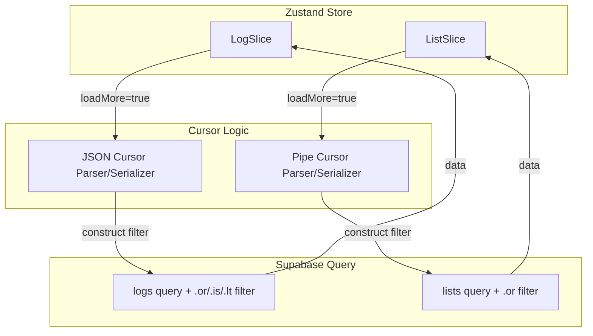
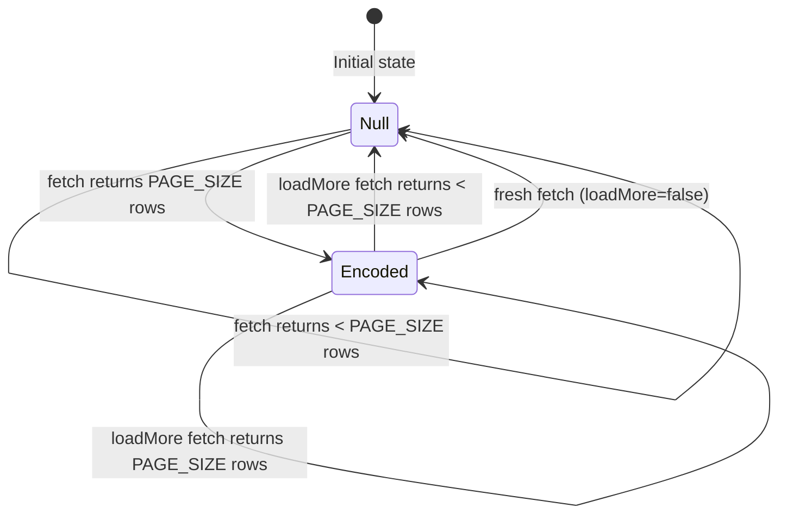

# Design Document: Cursor Pagination Migration

## Overview

This design migrates the last two offset-paginated fetchers (`fetchLogsOp` and `fetchLists`) to cursor-based keyset pagination. The migration aligns with established patterns in `watchlistSlice.ts` and `archiveSlice.ts`, eliminating row skipping/duplication caused by concurrent inserts during offset pagination.

Two distinct cursor formats are used:
- **JSON Cursor** for logs — required because `watched_date` is nullable, demanding a three-field encoding to distinguish "null date" pages from "has date" pages.
- **Pipe Cursor** for lists — a simple `created_at|id` string, identical to watchlist/archive, since `created_at` is non-nullable.

No database schema changes are required. The `.range()` call is completely removed and replaced with `.limit(PAGE_SIZE)` combined with cursor-based `.or()` filters.

## Architecture



The cursor logic is inline within each fetch function (matching the existing pattern in watchlist/archive), not extracted into a shared utility. This keeps each slice self-contained and avoids coupling.

## Components and Interfaces

### LogSlice Interface (Before → After)

```typescript
// BEFORE
export interface LogSlice {
    logs: DomainLog[];
    logsHasMore: boolean;
    logsPage: number;          // ← REMOVED
    _loggedIndex: Record<number, DomainLog>;
    _fetchingLogs: boolean;
    // ... mutations unchanged
}

// AFTER
export interface LogSlice {
    logs: DomainLog[];
    logsHasMore: boolean;
    _logsCursor: string | null; // ← ADDED (JSON cursor)
    _loggedIndex: Record<number, DomainLog>;
    _fetchingLogs: boolean;
    // ... mutations unchanged
}
```

### ListSlice Interface (Before → After)

```typescript
// BEFORE
export interface ListSlice {
    lists: CustomList[];
    listsHasMore: boolean;
    listsPage: number;          // ← REMOVED
    _fetchingLists: boolean;
    // ... mutations unchanged
}

// AFTER
export interface ListSlice {
    lists: CustomList[];
    listsHasMore: boolean;
    _listsCursor: string | null; // ← ADDED (pipe cursor)
    _fetchingLists: boolean;
    // ... mutations unchanged
}
```

### fetchLogsOp Query Construction (Pseudocode)

```
function fetchLogsOp(set, get, loadMore = false):
    guard: no user, already fetching, or (loadMore and !hasMore) → return
    set(_fetchingLogs = true)

    PAGE_SIZE = 50

    query = supabase.from('logs').select(LOG_SELECT_COLUMNS).eq('user_id', user.id)
        .order('watched_date', { ascending: false })
        .order('created_at', { ascending: false })
        .limit(PAGE_SIZE)                         // ← replaces .range()

    cursor = loadMore ? state._logsCursor : null

    if cursor:
        try:
            parsed = JSON.parse(cursor)
            if parsed.wasDateNull:
                query = query.is('watched_date', null).lt('id', parsed.lastId)
            else if parsed.lastDate:
                safeDate = parsed.lastDate.replace(/"/g, '""')
                safeId = parsed.lastId
                query = query.or(
                    `watched_date.lt."${safeDate}",and(watched_date.eq."${safeDate}",id.lt.${safeId}),watched_date.is.null`
                )
        catch:
            // Malformed cursor → treat as null (fresh fetch)
            cursor = null

    { data, error } = await query

    if error or !data:
        set(_fetchingLogs = false)
        return

    hasMore = data.length === PAGE_SIZE

    // Compute next cursor from last row
    lastRow = data[data.length - 1] if data.length > 0 else null
    nextCursor = hasMore && lastRow
        ? JSON.stringify({ lastDate: lastRow.watched_date, lastId: lastRow.id, wasDateNull: lastRow.watched_date === null })
        : null

    // --- Offline queue reconciliation (PRESERVED EXACTLY) ---
    // pendingRemoves, pendingUpdates, pendingAdds logic unchanged
    // Map-based deduplication unchanged
    // sortLogs unchanged
    // ---

    set({
        logs: deduplicatedLogs,
        _loggedIndex: idx,
        _logsCursor: nextCursor,
        logsHasMore: hasMore,
        _fetchingLogs: false,
    })

    // Background Image.prefetch (PRESERVED)
```

### fetchLists Query Construction (Pseudocode)

```
function fetchLists(set, get, loadMore = false):
    guard: no user, already fetching, or (loadMore and !hasMore) → return
    set(_fetchingLists = true)

    PAGE_SIZE = 20

    query = supabase.from('lists').select(`
        id, user_id, title, description, is_ranked, is_private, created_at,
        list_items ( id, film_id, film_title, poster_path, position )
    `)
        .eq('user_id', user.id)
        .order('created_at', { ascending: false })
        .order('id', { ascending: false })
        .order('position', { foreignTable: 'list_items', ascending: true })
        .limit(PAGE_SIZE)                         // ← replaces .range()

    cursor = loadMore ? state._listsCursor : null

    if cursor:
        parts = cursor.split('|')
        if parts.length === 2:
            [cursorDate, cursorId] = parts
            query = query.or(
                `created_at.lt.${cursorDate},and(created_at.eq.${cursorDate},id.lt.${cursorId})`
            )
        else:
            // Malformed cursor → treat as null (fresh fetch)
            cursor = null

    { data, error } = await query

    if error or !data:
        set(_fetchingLists = false)
        return

    hasMore = data.length === PAGE_SIZE

    // Compute next cursor from last row
    lastRow = data[data.length - 1] if data.length > 0 else null
    nextCursor = hasMore && lastRow
        ? `${lastRow.created_at}|${lastRow.id}`
        : null

    newLists = data.map(mapListRow)
    nextLists = loadMore ? [...state.lists, ...newLists] : newLists

    set({
        lists: nextLists,
        _listsCursor: nextCursor,
        listsHasMore: hasMore,
        _fetchingLists: false,
    })

    // Chunked Image.prefetch (PRESERVED — 5-at-a-time, 1s delay)
```

## Data Models

### JSON Cursor Shape (Logs)

```typescript
interface LogsCursor {
    lastDate: string | null;  // watched_date of last row (ISO string or null)
    lastId: string;           // UUID of last row
    wasDateNull: boolean;     // true when lastDate is null
}
```

**Serialization:** `JSON.stringify(cursor)`
**Deserialization:** `JSON.parse(cursorString)` wrapped in try/catch

### Pipe Cursor Shape (Lists)

```typescript
// Encoded as: `${created_at}|${id}`
// Decoded via: cursor.split('|') → [cursorDate, cursorId]
```

**Serialization:** Template literal concatenation
**Deserialization:** `String.split('|')` with length check

### Cursor Lifecycle State Machine



### Error Resilience

Both cursor parsers include fallback behavior:
- **JSON cursor:** If `JSON.parse()` throws or the parsed object lacks required fields (`lastId`), treat as `null` → fresh fetch.
- **Pipe cursor:** If `split('|')` doesn't produce exactly 2 non-empty parts, treat as `null` → fresh fetch.

This ensures corrupted persisted state never causes a crash or infinite loop.

## Correctness Properties

*A property is a characteristic or behavior that should hold true across all valid executions of a system — essentially, a formal statement about what the system should do. Properties serve as the bridge between human-readable specifications and machine-verifiable correctness guarantees.*

### Property 1: JSON cursor round-trip

*For any* valid last-row object with fields `watched_date: string | null` and `id: string`, serializing the cursor via `JSON.stringify({ lastDate: row.watched_date, lastId: row.id, wasDateNull: row.watched_date === null })` and then parsing via `JSON.parse()` SHALL produce an object where `lastDate === row.watched_date`, `lastId === row.id`, and `wasDateNull === (row.watched_date === null)`.

**Validates: Requirements 1.4**

### Property 2: Pipe cursor round-trip

*For any* valid last-row object with fields `created_at: string` (non-empty, no pipe characters) and `id: string` (non-empty, no pipe characters), serializing the cursor as `${created_at}|${id}` and then splitting on `'|'` SHALL produce exactly `[created_at, id]`.

**Validates: Requirements 2.2**

### Property 3: hasMore derivation from data length

*For any* array of fetched data rows, `hasMore` SHALL be `true` if and only if `data.length === PAGE_SIZE`. When `hasMore` is `false`, the next cursor SHALL be `null`.

**Validates: Requirements 1.6, 2.4, 3.3, 3.4**

### Property 4: Pending removes are excluded from output

*For any* set of server-returned log rows and any set of pending remove IDs, the merged output SHALL contain no log whose ID appears in the pending removes set.

**Validates: Requirements 5.1**

### Property 5: Pending updates are applied to matching rows

*For any* server-returned log row that has a matching pending update entry, the output row SHALL contain the fields from the pending update payload merged over the original row fields.

**Validates: Requirements 5.2**

### Property 6: Pending adds are prepended on fresh fetch

*For any* set of pending add entries (not in pending removes) and any set of server-returned rows when `loadMore=false`, all pending add entries SHALL appear in the merged output list.

**Validates: Requirements 5.3**

### Property 7: Deduplication produces unique IDs

*For any* merged list of logs (server rows + pending entries), after Map-based deduplication by ID, the output list SHALL contain no two entries with the same ID.

**Validates: Requirements 5.4**

### Property 8: Sort order invariant

*For any* deduplicated list of logs, after applying `sortLogs`, the output SHALL be in descending order by `watchedDate` (falling back to `createdAt`).

**Validates: Requirements 5.5**

### Property 9: Malformed cursor resilience

*For any* string that is not valid JSON (for logs) or does not split into exactly 2 non-empty parts (for lists), the system SHALL treat it as a null cursor and perform a fresh fetch without throwing.

**Validates: Requirements 8.3**

## Error Handling

| Scenario | Behavior |
|----------|----------|
| Supabase query returns error | Set `_fetching*` to false, return early. State unchanged. |
| JSON.parse throws on cursor | Treat cursor as null, proceed with fresh fetch (no `.or()` filter). |
| Pipe split produces ≠ 2 parts | Treat cursor as null, proceed with fresh fetch. |
| No user authenticated | Return early, no state change. |
| Concurrent fetch (guard active) | Return early, existing fetch continues. |
| loadMore with hasMore=false | Return early, no network request. |
| Empty data response | Set hasMore=false, cursor=null. Logs: merge with pending adds only. Lists: empty list. |

## Testing Strategy

### Property-Based Tests (fast-check, ≥100 iterations each)

The following universal properties will be validated with `fast-check`:

1. **JSON cursor round-trip** — Generate random `{ watched_date: string | null, id: uuid }` rows, verify serialize → parse identity.
2. **Pipe cursor round-trip** — Generate random `{ created_at: iso_string, id: uuid }` rows, verify serialize → split identity.
3. **hasMore derivation** — Generate random arrays of length 0..PAGE_SIZE+5, verify `hasMore` iff length === PAGE_SIZE.
4. **Pending removes exclusion** — Generate random log arrays + remove sets, verify no removed ID in output.
5. **Pending updates application** — Generate random rows + update payloads, verify fields merged.
6. **Pending adds prepend** — Generate random add entries + server rows, verify all adds present in output.
7. **Deduplication invariant** — Generate lists with intentional duplicate IDs, verify unique output.
8. **Sort order invariant** — Generate random log arrays, verify descending date order after sort.
9. **Malformed cursor resilience** — Generate random non-JSON strings / strings without pipes, verify no throw and fresh-fetch behavior.

Each test tagged: `// Feature: cursor-pagination-migration, Property N: <title>`

### Unit Tests (example-based)

- Fresh fetch resets cursor to null (logs and lists)
- loadMore=false replaces existing data
- `wasDateNull=true` branch constructs `.is().lt()` query
- `wasDateNull=false` branch constructs `.or()` query
- Pipe cursor with valid parts constructs correct `.or()` query
- Concurrency guard prevents double-fetch
- Image.prefetch called with correct poster URLs

### Integration Tests

- End-to-end fetch with mocked Supabase returning PAGE_SIZE rows → verify cursor set
- End-to-end fetch with mocked Supabase returning < PAGE_SIZE rows → verify cursor null
- Foreign table join preserved in lists query (select string + foreignTable order)

### Test Configuration

- Library: `fast-check` (already available in JS/TS ecosystem)
- Minimum iterations: 100 per property test
- Tag format: `Feature: cursor-pagination-migration, Property {number}: {title}`
