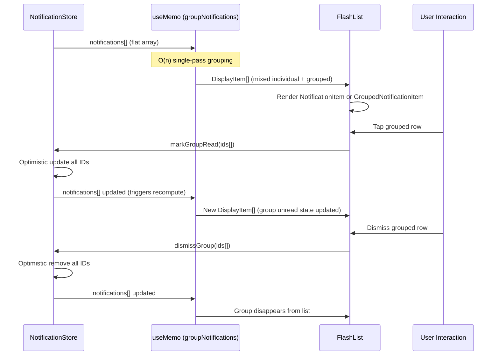

# Design Document: Notification Grouping

## Overview

When a user goes viral on Reelhouse (e.g., 200 people endorse their review), the notifications modal renders 200 identical rows — making it unusable at scale. This feature introduces a pure view-layer grouping transformation that collapses identical endorsement notifications into a single grouped row (e.g., "47 cinephiles endorsed your review of Stalker") without modifying the underlying notification store, API, or database schema.

The design is intentionally minimal: a single `useMemo` transformation sits between the flat `notifications[]` array and the FlashList `data` prop. This preserves all existing behavior — pagination, mark-read, dismiss, realtime injection — while delivering a dramatically improved UX for viral moments.

## Architecture

```mermaid
graph TD
    subgraph Store ["useNotificationStore (UNCHANGED)"]
        A[notifications: AppNotification[]]
        B[markRead / dismiss / fetchNotifications]
        C[Realtime WS injection]
    end

    subgraph ViewLayer ["notifications-modal.tsx"]
        D["useMemo → groupNotifications()"]
        E[FlashList data={displayItems}]
        F[NotificationItem — individual]
        G[GroupedNotificationItem — grouped]
    end

    A --> D
    D --> E
    E -->|type === 'group'| G
    E -->|type === 'individual'| F
    G -->|"tap → markGroupRead(ids)"| B
    G -->|"dismiss → dismissGroup(ids)"| B
    F -->|"tap → markRead(id)"| B
    F -->|"dismiss → dismiss(id)"| B
```

## Data Flow — Grouping Pipeline



## Components and Interfaces

### Component 1: `groupNotifications` (Pure Utility)

**Purpose**: Transforms a flat `AppNotification[]` into a `DisplayItem[]` where eligible endorsements are collapsed into group entries.

**Responsibilities**:
- Single-pass O(n) grouping of endorsement notifications
- Enforce minimum group size (3)
- Enforce 72-hour time window
- Derive group key from notification type + target (film_id or message pattern)
- Produce stable output for React reconciliation

### Component 2: `GroupedNotificationItem` (UI Component)

**Purpose**: Renders a collapsed group row with count badge, grouped message, poster thumbnail, and aggregate unread state.

**Responsibilities**:
- Display "{count} cinephiles endorsed your review of {film}"
- Show unread indicator if ANY notification in group is unread
- Handle tap → mark all in group as read + navigate
- Handle dismiss → remove all in group

### Component 3: Store Extensions (Two New Methods)

**Purpose**: Batch operations for grouped notifications that follow the existing optimistic-update + rollback pattern.

**Responsibilities**:
- `markGroupRead(ids: string[])` — mark multiple notifications read in one optimistic update
- `dismissGroup(ids: string[])` — remove multiple notifications in one optimistic update

## Data Models

### DisplayItem (Union Type)

```typescript
/** Individual notification — passes through unchanged */
interface IndividualDisplayItem {
  kind: 'individual';
  notification: AppNotification;
}

/** Grouped notification — represents N collapsed notifications */
interface GroupedDisplayItem {
  kind: 'group';
  /** Stable key for FlashList (e.g., "endorse:film:12345") */
  groupKey: string;
  /** All notification IDs in this group */
  ids: string[];
  /** Notification type (always 'endorse' for now) */
  type: string;
  /** Target film_id (used for navigation and poster) */
  film_id?: number;
  /** Poster path from the most recent notification */
  poster_path?: string;
  /** Pre-formatted display message */
  message: string;
  /** Timestamp of the most recent notification in group */
  created_at: string;
  /** True if ANY notification in the group is unread */
  hasUnread: boolean;
  /** Total count of notifications in group */
  count: number;
}

type DisplayItem = IndividualDisplayItem | GroupedDisplayItem;
```

**Validation Rules**:
- `GroupedDisplayItem.count` is always ≥ 3 (minimum group size)
- `GroupedDisplayItem.ids.length === GroupedDisplayItem.count`
- `GroupedDisplayItem.created_at` equals the max `created_at` across all grouped notifications
- `GroupedDisplayItem.hasUnread` equals `ids.some(id => notification[id].read === false)`

### GroupKey Derivation

```typescript
/** Derive a stable group key from a notification */
function getGroupKey(n: AppNotification): string | null {
  // Only group endorsements
  if (n.type !== 'endorse') return null;

  // Group by film_id if present
  if (n.film_id) return `endorse:film:${n.film_id}`;

  // Fallback: extract target from message pattern
  // e.g., "endorsed your review of Stalker" → "endorse:msg:Stalker"
  const match = n.message.match(/your review of (.+)$/);
  if (match) return `endorse:msg:${match[1]}`;

  return null;
}
```

## Key Functions with Formal Specifications

### Function 1: `groupNotifications()`

```typescript
function groupNotifications(
  notifications: AppNotification[],
  now?: number
): DisplayItem[]
```

**Preconditions:**
- `notifications` is a valid array (may be empty)
- Notifications are sorted by `created_at` descending (most recent first — guaranteed by store)
- `now` defaults to `Date.now()` (injectable for testing)

**Postconditions:**
- Returns array where every input notification appears exactly once (either in a group or as individual)
- Total count across all DisplayItems equals `notifications.length`
- Groups contain only notifications of type `'endorse'` with matching group keys
- Groups contain only notifications within 72 hours of `now`
- Every group has `count >= 3`
- Groups with fewer than 3 eligible items are emitted as individual items
- Output preserves chronological order (most recent first) based on each item's most recent timestamp
- Function is pure (no side effects, no mutations)

**Loop Invariants:**
- At each iteration `i`, all notifications `[0..i-1]` have been assigned to exactly one bucket or emitted individually
- The `buckets` map contains only keys with eligible (within time window) endorsement notifications

### Function 2: `markGroupRead()`

```typescript
// Added to useNotificationStore
markGroupRead: (ids: string[]) => Promise<void>
```

**Preconditions:**
- `ids` is a non-empty array of valid notification IDs
- All IDs exist in `state.notifications`

**Postconditions:**
- All notifications with matching IDs have `read: true` in state
- `_unreadCount` decremented by the count of notifications that were previously unread
- On Supabase error: state rolls back to previous values
- Single Supabase `.in('id', ids)` query (batch, not N individual calls)

### Function 3: `dismissGroup()`

```typescript
// Added to useNotificationStore
dismissGroup: (ids: string[]) => Promise<void>
```

**Preconditions:**
- `ids` is a non-empty array of valid notification IDs
- All IDs exist in `state.notifications`

**Postconditions:**
- All notifications with matching IDs are removed from `state.notifications`
- `_unreadCount` decremented by count of unread notifications in the dismissed set
- On Supabase error: state rolls back to previous array
- Single Supabase `.in('id', ids)` delete query

## Algorithmic Pseudocode

### Main Grouping Algorithm

```typescript
function groupNotifications(
  notifications: AppNotification[],
  now: number = Date.now()
): DisplayItem[] {
  const WINDOW_MS = 72 * 60 * 60 * 1000; // 72 hours
  const MIN_GROUP_SIZE = 3;
  const cutoff = now - WINDOW_MS;

  // Phase 1: Single-pass bucket collection
  // Map<groupKey, AppNotification[]>
  const buckets = new Map<string, AppNotification[]>();
  const nonGroupable: AppNotification[] = [];

  for (const n of notifications) {
    const key = getGroupKey(n);
    const withinWindow = new Date(n.created_at).getTime() >= cutoff;

    if (key && withinWindow) {
      const bucket = buckets.get(key);
      if (bucket) bucket.push(n);
      else buckets.set(key, [n]);
    } else {
      nonGroupable.push(n);
    }
  }

  // Phase 2: Emit groups or dissolve undersized buckets
  const result: DisplayItem[] = [];
  const dissolved: AppNotification[] = [];

  for (const [key, items] of buckets) {
    if (items.length >= MIN_GROUP_SIZE) {
      // Emit as grouped item
      const mostRecent = items[0]; // Already sorted descending
      result.push({
        kind: 'group',
        groupKey: key,
        ids: items.map(n => n.id),
        type: 'endorse',
        film_id: mostRecent.film_id,
        poster_path: mostRecent.poster_path,
        message: `${items.length} cinephiles endorsed your review of ${extractFilmName(mostRecent)}`,
        created_at: mostRecent.created_at,
        hasUnread: items.some(n => !n.read),
        count: items.length,
      });
    } else {
      // Dissolve: push back as individual items
      dissolved.push(...items);
    }
  }

  // Phase 3: Merge dissolved + nonGroupable, sort by created_at desc
  const individuals: DisplayItem[] = [...nonGroupable, ...dissolved]
    .sort((a, b) => new Date(b.created_at).getTime() - new Date(a.created_at).getTime())
    .map(n => ({ kind: 'individual', notification: n }));

  // Phase 4: Merge groups + individuals, sort by most recent timestamp
  const all = [...result, ...individuals].sort((a, b) => {
    const tsA = a.kind === 'group' ? a.created_at : a.notification.created_at;
    const tsB = b.kind === 'group' ? b.created_at : b.notification.created_at;
    return new Date(tsB).getTime() - new Date(tsA).getTime();
  });

  return all;
}
```

### Helper: Extract Film Name

```typescript
function extractFilmName(n: AppNotification): string {
  const match = n.message.match(/your review of (.+)$/);
  return match?.[1] ?? 'your review';
}
```

### Store Method: markGroupRead

```typescript
markGroupRead: async (ids: string[]) => {
  const previousState = get().notifications;
  const unreadInGroup = previousState.filter(
    n => ids.includes(n.id) && !n.read
  ).length;

  // Optimistic update
  set(state => ({
    notifications: state.notifications.map(n =>
      ids.includes(n.id) ? { ...n, read: true } : n
    ),
    _unreadCount: state._unreadCount - unreadInGroup,
  }));

  try {
    const { error } = await supabase
      .from('notifications')
      .update({ read: true })
      .in('id', ids);
    if (error) throw error;
  } catch (e) {
    logger.warn(`[markGroupRead] Failed for ${ids.length} items:`, e);
    // Rollback
    set({
      notifications: previousState,
      _unreadCount: previousState.filter(n => !n.read).length,
    });
  }
}
```

### Store Method: dismissGroup

```typescript
dismissGroup: async (ids: string[]) => {
  const previousState = get().notifications;
  const unreadDismissed = previousState.filter(
    n => ids.includes(n.id) && !n.read
  ).length;

  // Optimistic update
  set(state => ({
    notifications: state.notifications.filter(n => !ids.includes(n.id)),
    _unreadCount: state._unreadCount - unreadDismissed,
  }));

  try {
    const { error } = await supabase
      .from('notifications')
      .delete()
      .in('id', ids);
    if (error) throw error;
  } catch (e) {
    logger.warn(`[dismissGroup] Failed for ${ids.length} items:`, e);
    // Rollback
    set({
      notifications: previousState,
      _unreadCount: previousState.filter(n => !n.read).length,
    });
  }
}
```

## Example Usage

### Integration in notifications-modal.tsx

```typescript
import { groupNotifications, DisplayItem } from '@/src/utils/groupNotifications';

export default function NotificationsModal() {
  const { notifications, markGroupRead, dismissGroup } = useNotificationStore();

  // Pure view-layer transformation — recomputes only when notifications[] changes
  const displayItems = useMemo(
    () => groupNotifications(notifications),
    [notifications]
  );

  const renderItem = useCallback(({ item, index }: { item: DisplayItem; index: number }) => {
    if (item.kind === 'group') {
      return <GroupedNotificationItem item={item} index={index} />;
    }
    return <NotificationItem item={item.notification} index={index} />;
  }, []);

  return (
    <FlashList
      data={displayItems}
      keyExtractor={item =>
        item.kind === 'group' ? item.groupKey : item.notification.id
      }
      renderItem={renderItem}
      estimatedItemSize={80}
      // ... existing props
    />
  );
}
```

### GroupedNotificationItem Component

```typescript
const GroupedNotificationItem = React.memo(function GroupedNotificationItem({
  item,
  index,
}: {
  item: GroupedDisplayItem;
  index: number;
}) {
  const posterUri = item.poster_path
    ? `https://image.tmdb.org/t/p/w92${item.poster_path}`
    : null;

  const handlePress = () => {
    if (item.hasUnread) {
      useNotificationStore.getState().markGroupRead(item.ids);
    }
    nav.back();
    InteractionManager.runAfterInteractions(() => {
      if (item.film_id) nav.push(`/film/${item.film_id}`);
    });
  };

  const handleDismiss = () => {
    TactileEngine.warn();
    useNotificationStore.getState().dismissGroup(item.ids);
  };

  return (
    <PressableScale
      style={[s.itemWrap, item.hasUnread && s.itemUnread]}
      onPress={handlePress}
      haptic="light"
    >
      {/* Count badge instead of single icon */}
      <View style={[s.iconCircle, s.groupBadge]}>
        <Text style={s.groupCount}>{item.count}</Text>
      </View>

      <View style={s.itemContent}>
        <Text style={s.itemMessage} numberOfLines={2}>
          {item.message}
        </Text>
        <Text style={s.itemTime}>{timeAgo(item.created_at)}</Text>
      </View>

      {posterUri && (
        <Image source={{ uri: posterUri }} style={s.miniPoster} />
      )}

      <PressableScale style={s.dismissBtn} onPress={handleDismiss}>
        <X size={12} color={colors.fog} />
      </PressableScale>
    </PressableScale>
  );
});
```

## Correctness Properties

*A property is a characteristic or behavior that should hold true across all valid executions of a system — essentially, a formal statement about what the system should do. Properties serve as the bridge between human-readable specifications and machine-verifiable correctness guarantees.*

### Property 1: Conservation

*For any* valid notifications array, the sum of counts across all output DisplayItems (where a group contributes its `count` and an individual contributes 1) SHALL equal the input array length, and every input notification ID SHALL appear exactly once across all output items.

**Validates: Requirements 3.1, 3.2, 3.3**

### Property 2: No ID Duplication

*For any* valid notifications array, the collection of all notification IDs extracted from the output DisplayItems SHALL contain no duplicates — i.e., the set size equals the array length.

**Validates: Requirements 3.3**

### Property 3: Minimum Group Size

*For any* output DisplayItem with `kind === 'group'`, the `count` field SHALL be greater than or equal to 3.

**Validates: Requirements 2.3, 2.4**

### Property 4: Type Constraint

*For any* output DisplayItem with `kind === 'group'`, the `type` field SHALL equal `'endorse'`, and all underlying notifications referenced by the group's `ids` SHALL have type `'endorse'`.

**Validates: Requirements 2.1**

### Property 5: Time Window

*For any* output DisplayItem with `kind === 'group'`, every notification referenced by the group's `ids` SHALL have a `created_at` timestamp within 72 hours of the `now` parameter passed to the Grouping_Function.

**Validates: Requirements 2.2**

### Property 6: Homogeneity

*For any* output DisplayItem with `kind === 'group'`, all notifications referenced by the group's `ids` SHALL produce the same GroupKey when passed through the `getGroupKey` derivation function, and that key SHALL equal the group's `groupKey` field.

**Validates: Requirements 2.5, 4.5**

### Property 7: Unread Accuracy

*For any* output DisplayItem with `kind === 'group'`, the `hasUnread` field SHALL equal `true` if and only if at least one notification referenced by the group's `ids` has `read === false`.

**Validates: Requirements 4.3, 4.4**

### Property 8: Chronological Order

*For any* valid notifications array, the output DisplayItem array SHALL be sorted in descending order by timestamp, where the timestamp of a group is its `created_at` field and the timestamp of an individual is its `notification.created_at` field.

**Validates: Requirements 5.1, 5.2**

### Property 9: Purity (No Mutation)

*For any* valid notifications array, calling `groupNotifications` SHALL not modify the input array or any of its contained notification objects — a deep equality check of the input before and after the call SHALL pass.

**Validates: Requirements 1.3, 10.3**

### Property 10: Store Invariant — Unread Count Accuracy

*For any* valid store state and any non-empty set of notification IDs, after executing `markGroupRead(ids)` or `dismissGroup(ids)`, the store's `_unreadCount` SHALL equal the count of notifications in `state.notifications` where `read === false`.

**Validates: Requirements 6.3, 7.3**

### Property 11: Count-IDs Consistency

*For any* output DisplayItem with `kind === 'group'`, the `count` field SHALL equal the length of the `ids` array.

**Validates: Requirements 4.1**

### Property 12: Most Recent Timestamp

*For any* output DisplayItem with `kind === 'group'`, the `created_at` field SHALL equal the maximum `created_at` value among all notifications referenced by the group's `ids`.

**Validates: Requirements 4.2**

### Property 13: Rollback on Failure

*For any* valid store state, if `markGroupRead(ids)` or `dismissGroup(ids)` encounters a Supabase error, the store's `notifications` array and `_unreadCount` SHALL equal their values from before the operation was attempted.

**Validates: Requirements 6.4, 7.4**

## Error Handling

### Scenario 1: Supabase Batch Update Failure (markGroupRead)

**Condition**: Network error or Supabase returns error on `.update().in('id', ids)`
**Response**: Log warning via `logger.warn`, rollback optimistic state to `previousState`
**Recovery**: User sees notifications revert to unread state; next pull-to-refresh re-syncs

### Scenario 2: Supabase Batch Delete Failure (dismissGroup)

**Condition**: Network error or Supabase returns error on `.delete().in('id', ids)`
**Response**: Log warning, rollback optimistic removal
**Recovery**: Dismissed group re-appears in list; user can retry

### Scenario 3: Malformed Notification Data

**Condition**: A notification has invalid `created_at` (e.g., `null` or unparseable)
**Response**: `getGroupKey` returns `null`, notification treated as non-groupable individual
**Recovery**: Graceful degradation — notification renders normally, no crash

### Scenario 4: Empty Notifications Array

**Condition**: User has no notifications
**Response**: `groupNotifications([])` returns `[]`, FlashList renders EmptyState
**Recovery**: N/A — correct behavior

## Testing Strategy

### Unit Testing Approach

Test `groupNotifications()` in isolation with deterministic `now` parameter:

| Test Case | Input | Expected |
|-----------|-------|----------|
| Empty array | `[]` | `[]` |
| All non-endorse | 5 comments | 5 individual items |
| 2 same-target endorsements | 2 endorse same film | 2 individual (below threshold) |
| 3 same-target endorsements | 3 endorse same film | 1 group (count=3) |
| Mixed types | 5 endorse film A + 2 comments | 1 group + 2 individuals |
| Time window boundary | 4 endorse, 2 outside 72h window | 1 group(2) dissolved + 2 individuals OR adjusted based on remaining |
| Multiple groups | 5 endorse film A + 4 endorse film B | 2 groups |
| Null film_id, message pattern | endorse with message match | Groups by message pattern |

### Property-Based Testing Approach

**Property Test Library**: `fast-check`

Generate random `AppNotification[]` arrays with:
- Random types (weighted toward 'endorse')
- Random `film_id` values (small pool to force collisions)
- Random `created_at` timestamps within and outside the 72h window
- Random `read` states

Verify properties P1–P10 hold for all generated inputs.

### Integration Testing Approach

- Verify FlashList renders grouped items correctly
- Verify tap on group calls `markGroupRead` with correct IDs
- Verify dismiss on group calls `dismissGroup` with correct IDs
- Verify realtime injection of new endorsement updates group count in next render

## Performance Considerations

- **O(n) algorithm**: Single pass through notifications array + Map operations (O(1) amortized)
- **useMemo dependency**: Only recomputes when `notifications` reference changes (Zustand shallow equality)
- **No additional renders**: Grouped items use stable `groupKey` for FlashList reconciliation
- **Memory**: One Map allocation per recomputation; Map entries ≤ unique film count (typically < 50)
- **Worst case**: 500 notifications (store cap) × O(1) per item = negligible
- **FlashList estimatedItemSize**: Remains 80px — grouped rows have same height as individual rows

## Security Considerations

- No new API surface exposed — all grouping is client-side
- `markGroupRead` and `dismissGroup` use the same Supabase RLS policies as existing `markRead`/`dismiss`
- No cross-user data leakage possible — store is scoped to authenticated user
- IDs array in `.in('id', ids)` is derived from client-side store (already validated by Zod on fetch/realtime)

## Dependencies

- **Existing** (no new installs):
  - `zustand` — state management (store extensions)
  - `@shopify/flash-list` — virtualized list
  - `expo-image` — poster thumbnails
  - `lucide-react-native` — icons
  - `react-native-reanimated` — animations
- **Dev dependency for testing**:
  - `fast-check` — property-based testing (if not already installed)
