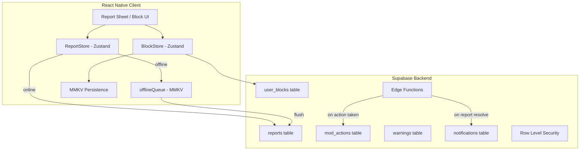
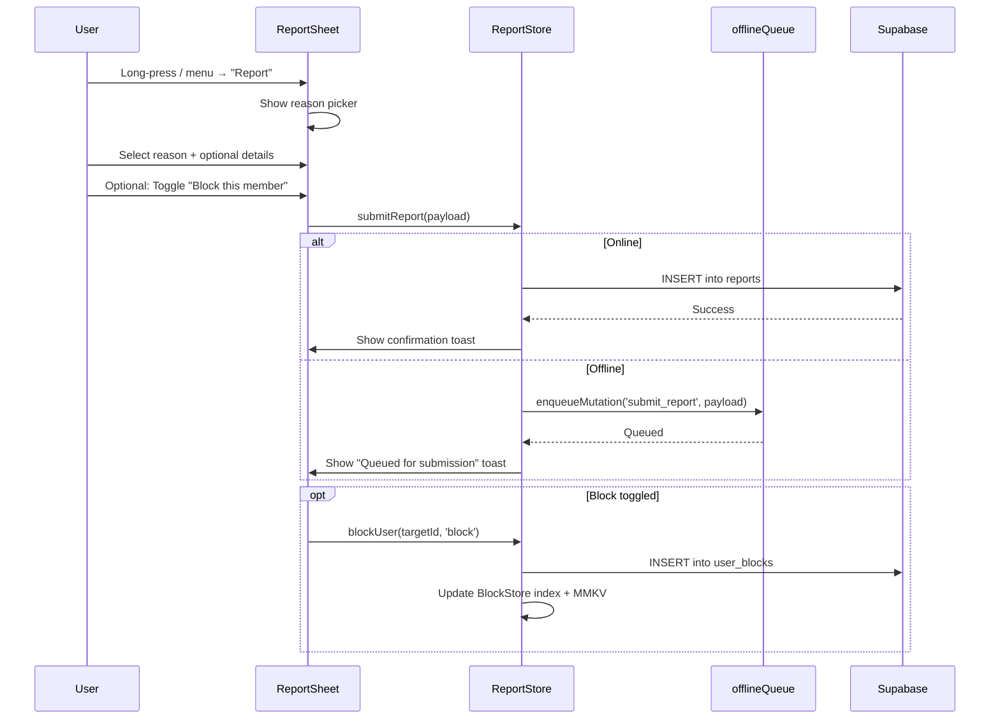
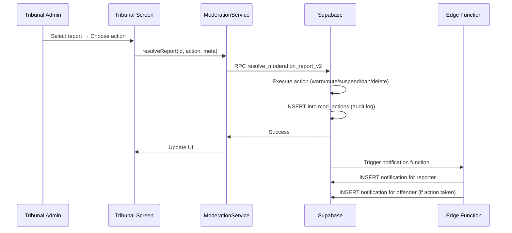
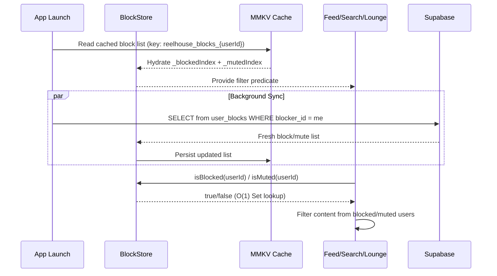

# Design Document: Society Report System

## Overview

The Society Report System is a comprehensive content reporting, blocking/muting, and moderation framework for the ReelHouse mobile app. It extends the existing `ModerationService` and Tribunal admin screen to cover all content types (logs, stacks, comments, lounge messages, dossiers, profiles), introduces a user-facing report flow with offline support, adds a Block/Mute system for user-level content filtering, expands report categories and reasons to match the "secret society of cinema" aesthetic, and enhances admin tooling with warnings, suspensions, bulk actions, and notification integration.

The system is designed around three pillars: (1) a frictionless user-facing report flow that queues offline via MMKV, (2) a performant client-side block/mute layer with O(1) lookups persisted in MMKV for instant cold-start filtering, and (3) an enhanced Tribunal admin experience with graduated enforcement (warning → mute → suspension → ban → permanent exile) and full audit trail.

Every surface in this system adheres to the Nitrate Noir design language — aged tungsten tones, cinematic typography, spring-based micro-interactions, and a visual vocabulary that feels like filing a classified report in a 1940s film noir bureau.

## Architecture




## Sequence Diagrams

### User Report Flow



### Admin Resolution Flow




### Block/Mute Filtering Flow



---

## UI Placement Specification

### Exact Button Positions Per Screen

Every report/block/mute trigger follows the same interaction pattern: a `MoreHorizontal` or `MoreVertical` icon button that opens a bottom ActionSheet (BlurView backdrop, gesture-dismissible, spring-animated). This reuses the exact component architecture from `src/components/lounge/ActionSheet.tsx`.


#### 1. Log Detail Screen (`app/log/[id].tsx`)

**Trigger Location**: Header bar — a new `MoreHorizontal` (lucide) icon button positioned to the RIGHT of the existing `Share2` button (the "SHARE" PressableScale). Sits in the same `s.header` flex row.

**Visibility Condition**: `!isOwner` — only renders when viewing someone else's log.

**Implementation**:
```typescript
// Positioned after the existing shareBtn in the header row
{!isOwner && (
  <PressableScale
    style={s.moreBtn}
    onPress={() => setReportSheetVisible(true)}
    hitSlop={{ top: 15, bottom: 15, left: 15, right: 15 }}
    haptic="selection"
    pressedScale={0.92}
    accessibilityLabel="More options"
    accessibilityHint="Report, block, or mute this member"
  >
    <MoreHorizontal size={16} color={colors.fog} strokeWidth={1.5} />
  </PressableScale>
)}
```

**Style** (`s.moreBtn`):
```typescript
moreBtn: {
  flexDirection: 'row',
  alignItems: 'center',
  justifyContent: 'center',
  paddingHorizontal: 10,
  paddingVertical: 8,
  marginLeft: 8,
}
```

**ActionSheet Options** (triggered on press):
| Option Label | Icon | Icon Color | Destructive |
|---|---|---|---|
| "REPORT TO THE TRIBUNAL" | `ShieldAlert` (18px) | `colors.fog` | No |
| "BLOCK @{username}" | `Ban` (18px) | `colors.bloodReel` | Yes |
| "MUTE @{username}" | `VolumeX` (18px) | `colors.fog` | No |


#### 2. User Profile Screen (`app/user/[username].tsx`)

**Trigger Location**: Top-right navigation area — a `MoreVertical` icon button. Positioned in the profile header's action bar, aligned to the trailing edge (after follow button, before edge).

**Visibility Condition**: `!isSelf` — only renders on profiles that are NOT the authenticated user's own profile.

**Implementation**:
```typescript
// In the profile header action row (top-right)
{!isSelf && (
  <PressableScale
    style={s.moreBtn}
    onPress={() => setProfileActionSheet(true)}
    hitSlop={{ top: 15, bottom: 15, left: 15, right: 15 }}
    haptic="selection"
    pressedScale={0.92}
    accessibilityLabel="More options for this member"
  >
    <MoreVertical size={18} color={colors.fog} strokeWidth={1.5} />
  </PressableScale>
)}
```

**ActionSheet Options** (dynamic based on block/mute state):
| Option Label | Icon | Icon Color | Condition |
|---|---|---|---|
| "REPORT MEMBER" | `ShieldAlert` (18px) | `colors.fog` | Always |
| "BLOCK @{username}" | `Ban` (18px) | `colors.bloodReel` | `!isBlocked` |
| "UNBLOCK @{username}" | `Unlock` (18px) | `colors.sepia` | `isBlocked` |
| "MUTE @{username}" | `VolumeX` (18px) | `colors.fog` | `!isMuted && !isBlocked` |
| "UNMUTE @{username}" | `Volume2` (18px) | `colors.sepia` | `isMuted` |


#### 3. Stacks Detail Screen (`app/stacks/[id].tsx`)

**Trigger Location**: Header bar — `MoreHorizontal` icon button positioned to the RIGHT of existing header actions (same pattern as log detail). Sits at the trailing edge of the header row.

**Visibility Condition**: `!isOwner` — only for stacks the user did not create.

**Implementation**:
```typescript
// In the header row, after any existing action buttons
{!isOwner && (
  <PressableScale
    style={s.moreBtn}
    onPress={() => setStackActionSheet(true)}
    hitSlop={{ top: 15, bottom: 15, left: 15, right: 15 }}
    haptic="selection"
    pressedScale={0.92}
    accessibilityLabel="More options for this stack"
  >
    <MoreHorizontal size={16} color={colors.fog} strokeWidth={1.5} />
  </PressableScale>
)}
```

**ActionSheet Options**:
| Option Label | Icon | Icon Color | Destructive |
|---|---|---|---|
| "REPORT STACK" | `ShieldAlert` (18px) | `colors.fog` | No |
| "BLOCK CURATOR" | `Ban` (18px) | `colors.bloodReel` | Yes |
| "MUTE CURATOR" | `VolumeX` (18px) | `colors.fog` | No |


#### 4. Lounge Chat (`app/lounge/[id].tsx`)

**Trigger Location**: EXTENDS the existing `ActionSheet` component (`src/components/lounge/ActionSheet.tsx`). New options are appended at the bottom of the existing options list (REPLY, COPY TEXT, DELETE) — only visible when `!isSelf` (viewing someone else's message).

**Visibility Condition**: `!internalIsSelf` — options only appear for messages authored by another user.

**Implementation** (inside existing `ActionSheet` component):
```typescript
// After the existing COPY TEXT button, before the DELETE button (for non-self messages)
{!internalIsSelf && (
  <>
    <PressableScale style={s.actionBtn} onPress={() => { onReport(internalMsg); onClose(); }} accessibilityRole="button">
      <ShieldAlert size={18} color={colors.fog} strokeWidth={1.5} />
      <Text style={s.actionBtnText}>REPORT MESSAGE</Text>
    </PressableScale>
    <PressableScale style={[s.actionBtn, s.actionBtnLast]} onPress={() => { onBlock(internalMsg.user_id); onClose(); }} accessibilityRole="button">
      <Ban size={18} color={colors.bloodReel} strokeWidth={1.5} />
      <Text style={[s.actionBtnText, s.actionBtnDanger]}>BLOCK @{internalMsg.username}</Text>
    </PressableScale>
  </>
)}
```

**New Props for ActionSheet**:
```typescript
interface ActionSheetProps {
  // ...existing props
  onReport?: (msg: LoungeMessage) => void;
  onBlock?: (userId: string) => void;
}
```


#### 5. Dossier Detail Screen (`app/dossier/[id].tsx`)

**Trigger Location**: Header bar — `MoreHorizontal` icon button at the trailing edge of the header (right side), following the same layout pattern as log detail.

**Visibility Condition**: `user?.id !== dossier?.user_id` — only for dossiers authored by someone else.

**Implementation**:
```typescript
// In the dossier header, right-aligned
{user?.id !== dossier?.user_id && (
  <PressableScale
    style={s.moreBtn}
    onPress={() => setDossierActionSheet(true)}
    hitSlop={{ top: 15, bottom: 15, left: 15, right: 15 }}
    haptic="selection"
    pressedScale={0.92}
    accessibilityLabel="More options for this dispatch"
  >
    <MoreHorizontal size={16} color={colors.fog} strokeWidth={1.5} />
  </PressableScale>
)}
```

**ActionSheet Options**:
| Option Label | Icon | Icon Color | Destructive |
|---|---|---|---|
| "REPORT DISPATCH" | `ShieldAlert` (18px) | `colors.fog` | No |
| "BLOCK AUTHOR" | `Ban` (18px) | `colors.bloodReel` | Yes |
| "MUTE AUTHOR" | `VolumeX` (18px) | `colors.fog` | No |


#### 6. Comments (Logs, Stacks, Dossiers)

**Trigger Location**: Long-press gesture on any comment that is NOT the current user's own comment. This triggers a mini ActionSheet (same component, reduced option set).

**Visibility Condition**: `comment.user_id !== currentUser.id`

**Implementation** (in LogComments, StackComments, DossierComments):
```typescript
<PressableScale
  onLongPress={() => {
    if (comment.user_id !== user?.id) {
      setSelectedComment(comment);
      setCommentActionSheet(true);
    }
  }}
  delayLongPress={400}
  haptic="heavy"
  // ...existing comment row props
>
```

**ActionSheet Options** (mini variant):
| Option Label | Icon | Icon Color | Destructive |
|---|---|---|---|
| "REPORT ANNOTATION" | `ShieldAlert` (18px) | `colors.fog` | No |
| "BLOCK @{username}" | `Ban` (18px) | `colors.bloodReel` | Yes |

---


## Nitrate Noir Visual Specification

### Report ActionSheet (Trigger Sheet)

Reuses the identical component architecture from `src/components/lounge/ActionSheet.tsx`:

**Backdrop**:
- `BlurView` with `intensity={30}`, `tint="dark"` — exact match to Lounge ActionSheet
- Full `StyleSheet.absoluteFill` coverage
- Tap-to-dismiss on backdrop area via `PressableScale`

**Sheet Container**:
- `position: 'absolute', bottom: 0, left: 0, right: 0`
- `backgroundColor: colors.ink` (`#0A0906`)
- `borderTopLeftRadius: 16, borderTopRightRadius: 16`
- `borderWidth: 1, borderColor: 'rgba(196,150,26,0.15)'` (subtle sepia border glow)
- `padding: 24`
- `paddingBottom: Math.max(insets.bottom + 20, 24)`

**Handle Bar**:
- Width: 40, Height: 4, borderRadius: 2
- `backgroundColor: 'rgba(255,255,255,0.08)'`
- `alignSelf: 'center', marginBottom: 20`

**Animation**:
- Enter: `translateY` from 800 → 0, duration 350ms, `Easing.out(Easing.cubic)`
- Exit: `translateY` 0 → 800, duration 250ms, `Easing.out(Easing.cubic)`
- Opacity fade: 0 → 1 (300ms in), 1 → 0 (250ms out)
- Gesture dismissible: Pan.onChange → track translationY > 0; Pan.onEnd → dismiss if translationY > 100 or velocityY > 500

**Option Rows** (each action button):
- `flexDirection: 'row', alignItems: 'center', paddingVertical: 16, gap: 16`
- `borderBottomWidth: StyleSheet.hairlineWidth, borderBottomColor: colors.soot` (`#0D0C08`)
- Last row: `borderBottomWidth: 0`
- Text: `fontFamily: fonts.uiMedium` (`Inter_500Medium`), `fontSize: 12, letterSpacing: 2, color: colors.parchment` (`#E8DFD0`)
- Destructive text: `color: colors.bloodReel` (`#6B1A0A`)


### Report Sheet (Bottom Sheet Modal)

Triggered when the user selects any "Report" option from the trigger ActionSheet. This is a dedicated full report form.

**Backdrop**: Identical to trigger sheet — `BlurView`, intensity 30, tint dark.

**Sheet Container**:
- Same positioning and border-radius as trigger sheet
- Extended height: `height: '75%'` (more content to display)
- `backgroundColor: colors.ink` (`#0A0906`)
- `borderWidth: 1, borderColor: 'rgba(196,150,26,0.15)'`
- Scroll-enabled interior for reason chips

**Header**:
- Text: `"REPORT TO THE TRIBUNAL"`
- Font: `fontFamily: fonts.display` (`Rye_400Regular`), `fontSize: 20`, `letterSpacing: 2`
- Color: `colors.parchment` (`#E8DFD0`)
- Text shadow: `effects.textShadowDeep` — `textShadowColor: 'rgba(0,0,0,0.8)', offset: {0, 2}, radius: 4`
- Margin bottom: `spacing.md` (16)

**Subtext**:
- Text: `"Your report is confidential. The Tribunal will review within 24 hours."`
- Font: `fontFamily: fonts.body` (`CourierPrime_400Regular`), `fontSize: 12`
- Color: `colors.fog` (`#9E9488`)
- Margin bottom: `spacing.lg` (24)


**Reason Chips** (vertically stacked list):

Each reason is a `PressableScale` row with radio-style selection behavior (one at a time):

- Layout: `flexDirection: 'row', alignItems: 'center', paddingVertical: 14, paddingHorizontal: 16, gap: 12`
- Border radius: `radii.sm` (3)
- **Unselected State**:
  - `borderWidth: 1, borderColor: colors.ash` (`#2A2118`)
  - `backgroundColor: 'transparent'`
  - Label color: `colors.bone` (`#C2B492`)
- **Selected State**:
  - `borderWidth: 1, borderColor: colors.sepia` (`#B8891A`)
  - `backgroundColor: colors.sepiaFaint` (`rgba(196,150,26,0.08)`)
  - Label color: `colors.parchment` (`#E8DFD0`)
  - Outer glow: `effects.glowSepia` (shadowColor sepia, radius 20, opacity 0.3)
- **Animation on Select**: `withSpring(1.02, { damping: 18, stiffness: 400, mass: 0.6 })` then back to 1
- Label font: `fontFamily: fonts.sub` (`SpecialElite_400Regular`), `fontSize: 12, letterSpacing: 1`
- Sublabel font: `fontFamily: fonts.body` (`CourierPrime_400Regular`), `fontSize: 10, color: colors.fog`
- Gap between chips: `spacing.sm` (8)
- Haptic on select: `TactileEngine.selection()`

**Reason Labels & Sublabels** (Society Aesthetic Copy):
| Enum Value | Display Label | Sublabel |
|---|---|---|
| `spoiler_unmarked` | "UNMARKED SPOILERS" | "Contains untagged plot revelations" |
| `harassment` | "HARASSMENT" | "Targeting or intimidating a Society member" |
| `hate_speech` | "HATE SPEECH" | "Promotes hatred based on identity" |
| `spam` | "SPAM" | "Unsolicited promotion or repetitive content" |
| `inappropriate` | "INAPPROPRIATE" | "Explicit, violent, or disturbing material" |
| `impersonation` | "IMPERSONATION" | "Masquerading as another member" |
| `misinformation` | "MISINFORMATION" | "Deliberate falsehoods about films or persons" |
| `copyright` | "COPYRIGHT" | "Unauthorized reproduction of another's work" |
| `other` | "OTHER" | "Describe the infraction below" |


**Additional Context TextInput** (appears only when a reason is selected):

- Animated entry: `FadeInDown.duration(300)`
- Placeholder text: `"Describe the infraction..."` (color: `colors.fog`)
- Style:
  - `backgroundColor: colors.soot` (`#0D0C08`)
  - `borderWidth: 1, borderColor: colors.ash` (`#2A2118`)
  - `borderRadius: radii.sm` (3)
  - `fontFamily: fonts.body` (`CourierPrime_400Regular`), `fontSize: 14`
  - `color: colors.parchment` (`#E8DFD0`)
  - `padding: 16`
  - `minHeight: 80`
  - `textAlignVertical: 'top'`
- Focus state: `borderColor: colors.sepia` (`#B8891A`)
- Max length: 500 characters
- Character counter: positioned `position: 'absolute', bottom: 8, right: 12`
  - Font: `fonts.ui` (`Inter_400Regular`), `fontSize: 9, letterSpacing: 0.5`
  - Color: `colors.fog` (< 400 chars) / `colors.bloodReel` (≥ 450 chars)
  - Format: `"{count}/500"`

**"Also block this member" Toggle Row**:

- Layout: `flexDirection: 'row', alignItems: 'center', justifyContent: 'space-between', paddingVertical: 14`
- Label: `"Also block this member"` — `fontFamily: fonts.ui` (`Inter_400Regular`), `fontSize: 12, color: colors.bone` (`#C2B492`)
- Toggle switch:
  - Track inactive: `colors.ash` (`#2A2118`)
  - Track active: `colors.sepia` (`#B8891A`)
  - Thumb: `colors.parchment` (`#E8DFD0`)
  - iOS style switch (native `Switch` component with custom colors)
- Margin top: `spacing.md` (16)


**Submit Button ("FILE REPORT")**:

- Full width
- Text: `"FILE REPORT"` — `fontFamily: fonts.uiBold` (`Inter_700Bold`), `fontSize: 12, letterSpacing: 3, color: colors.parchment`
- Style:
  - `backgroundColor: colors.bloodReel` (`#6B1A0A`)
  - `borderRadius: radii.sm` (3)
  - `paddingVertical: 16`
  - `alignItems: 'center'`
- Pressed state: `pressedScale: 0.97` (heavier spring — `{ damping: 22, stiffness: 500, mass: 0.8 }`)
- Disabled state (no reason selected): `opacity: 0.4`, `pointerEvents: 'none'`
- Haptic on press: `TactileEngine.mutate()` (medium impact)
- Shadow: `shadowColor: colors.bloodReel, shadowOpacity: 0.4, shadowRadius: 12, shadowOffset: { width: 0, height: 4 }`
- Margin top: `spacing.lg` (24)

**Cancel Link ("DISMISS")**:

- Text: `"DISMISS"` — `fontFamily: fonts.sub` (`SpecialElite_400Regular`), `fontSize: 11, letterSpacing: 1.5`
- Color: `colors.fog` (`#9E9488`)
- Decoration: `textDecorationLine: 'underline'`
- `alignSelf: 'center'`
- Margin top: `spacing.md` (16)
- Haptic: `TactileEngine.selection()`


### Confirmation Toast

After successful report submission:
- `reelToast("Report filed. The Tribunal will review.")` — standard `reelToast` info style
- Haptic: `Haptics.notificationAsync(NotificationFeedbackType.Success)`

If offline:
- `reelToast("Report queued. Will be filed when connected.")` — standard info style
- Haptic: `Haptics.notificationAsync(NotificationFeedbackType.Success)`

If duplicate:
- `reelToast("You've already reported this content.")` — standard info style
- No haptic

### Block Confirmation

Inline feedback after blocking:
- `reelToast("@{username} blocked. Their content is now hidden.")` — info style
- Haptic: `Haptics.notificationAsync(NotificationFeedbackType.Warning)`
- Immediate visual effect: all content from blocked user disappears from current view (React Query invalidation)

### Mute Confirmation

- `reelToast("@{username} muted. Their content will be hidden from your feeds.")` — info style
- Haptic: `Haptics.notificationAsync(NotificationFeedbackType.Success)`

---


## Components and Interfaces

### Component 1: ReportSheet (UI)

**Purpose**: Bottom sheet modal that captures user report input with reason selection, optional details, and block toggle. Presented when user triggers "Report" on any content.

**Interface**:
```typescript
interface ReportSheetProps {
  visible: boolean;
  contentType: ReportableContentType;
  contentId: string;
  targetUserId: string;
  targetUsername: string;
  onDismiss: () => void;
}
```

**Responsibilities**:
- Render curated report reason list with society-themed labels
- Capture optional details text (max 500 chars)
- Offer "Block this member" toggle
- Submit report via ReportStore
- Show confirmation feedback with haptics
- Accessible: all interactive elements have labels, focus trap within sheet
- Dismiss via gesture (pan down) or DISMISS link


### Component 2: ContentActionSheet (Shared Trigger)

**Purpose**: Reusable ActionSheet component for content moderation triggers. Extends the Lounge ActionSheet pattern to all surfaces.

**Interface**:
```typescript
interface ContentActionSheetProps {
  visible: boolean;
  targetUserId: string;
  targetUsername: string;
  contentType: ReportableContentType;
  contentId: string;
  onClose: () => void;
  onReport: () => void;
  onBlock: () => void;
  onMute: () => void;
  onUnblock?: () => void;
  onUnmute?: () => void;
  showUnblock?: boolean;
  showUnmute?: boolean;
}
```

**Responsibilities**:
- Display contextual action options (Report/Block/Mute/Unblock/Unmute)
- Render with Nitrate Noir ActionSheet styling (BlurView, spring animation, gesture dismiss)
- Dynamic option rendering based on current block/mute state
- Haptic feedback on option selection


### Component 3: BlockStore (Zustand)

**Purpose**: Client-side store managing blocked and muted user lists with O(1) lookups, MMKV persistence, and Supabase sync.

**Interface**:
```typescript
interface BlockState {
  blocked: string[];
  muted: string[];
  _blockedIndex: Set<string>;
  _mutedIndex: Set<string>;

  // Queries
  isBlocked: (userId: string) => boolean;
  isMuted: (userId: string) => boolean;
  isHidden: (userId: string) => boolean; // blocked OR muted

  // Mutations
  blockUser: (targetId: string) => Promise<void>;
  unblockUser: (targetId: string) => Promise<void>;
  muteUser: (targetId: string) => Promise<void>;
  unmuteUser: (targetId: string) => Promise<void>;

  // Lifecycle
  hydrateFromCache: (userId: string) => void;
  syncFromServer: (userId: string) => Promise<void>;
  persistToCache: (userId: string) => void;
  clearOnLogout: () => void;
}
```

**MMKV Key Pattern**: `reelhouse_blocks_{userId}`

**Responsibilities**:
- Maintain in-memory Set indices for O(1) filtering
- Optimistic updates: update local state immediately, then persist to Supabase
- MMKV persistence for instant cold-start filtering (no network round-trip needed)
- Background sync on app foreground to catch cross-device changes
- Expose `isHidden()` predicate for feed/search/lounge filtering
- Clear on logout (resetAllStores pattern)

### Component 4: ReportStore (Zustand)

**Purpose**: Manages report submission state, offline queueing, and duplicate prevention.

**Interface**:
```typescript
interface ReportState {
  isSubmitting: boolean;
  recentReports: Set<string>; // content_id set for duplicate prevention

  submitReport: (payload: ReportPayload) => Promise<ReportResult>;
  hasReported: (contentId: string) => boolean;
}

type ReportResult = 
  | { status: 'submitted' }
  | { status: 'queued' }
  | { status: 'duplicate'; message: string }
  | { status: 'error'; message: string };
```

**Responsibilities**:
- Validate report payload via Zod schema
- Submit to Supabase when online, enqueue to offlineQueue when offline
- Track recently reported content to prevent duplicate submissions in same session
- Provide loading state for UI feedback


### Component 5: ModerationService (Extended)

**Purpose**: Backend service layer for report CRUD, moderation actions, and admin operations. Extends existing `ModerationService.ts`.

**Interface**:
```typescript
interface ModerationServiceExtended {
  // Existing
  submitReport(payload: ReportPayload): Promise<void>;
  getPendingReports(cursor?: string, limit?: number): Promise<PaginatedReports>;
  resolveReport(reportId: string, action: ModAction, meta: ActionMeta): Promise<void>;

  // New: Admin enhancements
  getReportHistory(filters: ReportFilters): Promise<PaginatedReports>;
  getUserModerationHistory(userId: string): Promise<ModActionRecord[]>;
  issueWarning(userId: string, reason: string): Promise<void>;
  suspendUser(userId: string, durationHours: number, reason: string): Promise<void>;
  bulkDismiss(reportIds: string[]): Promise<void>;
  getPriorityQueue(): Promise<PaginatedReports>;

  // New: Block/Mute
  getBlockList(userId: string): Promise<BlockRecord[]>;
  insertBlock(blockerId: string, blockedId: string, type: BlockType): Promise<void>;
  removeBlock(blockerId: string, blockedId: string): Promise<void>;
}
```

**Responsibilities**:
- Zod validation on all payloads before Supabase calls
- RPC calls for atomic multi-table operations
- Cursor-based pagination for report history
- Error mapping to user-friendly messages


### Component 6: NotificationService (Extended)

**Purpose**: Deliver moderation-related notifications to reporters and offenders.

**Interface**:
```typescript
interface ModerationNotifications {
  notifyReportResolved(reporterId: string, reportId: string, outcome: string): Promise<void>;
  notifyActionTaken(offenderId: string, action: ModAction, reason: string): Promise<void>;
  notifyWarning(userId: string, reason: string): Promise<void>;
}
```

**Responsibilities**:
- Create notification records in Supabase `notifications` table
- Triggered server-side via Edge Function after moderation actions
- Notification type: `'moderation'` with metadata containing action details


## Data Models

### ReportableContentType (Extended Enum)

```typescript
const ReportableContentType = z.enum([
  'log',              // Film log/review
  'list',             // Stack/curated list
  'log_comment',      // Comment on a log
  'list_comment',     // Comment on a list
  'dossier',          // Dispatch essay
  'dossier_comment',  // Comment on a dossier
  'lounge_message',   // Chat message in a lounge
  'profile',          // User profile (bio, avatar, username)
]);
type ReportableContentType = z.infer<typeof ReportableContentType>;
```

### ReportReason (Curated for Society Aesthetic)

```typescript
const ReportReason = z.enum([
  'spoiler_unmarked',
  'harassment',
  'hate_speech',
  'spam',
  'inappropriate',
  'impersonation',
  'misinformation',
  'copyright',
  'other',
]);
type ReportReason = z.infer<typeof ReportReason>;
```

### ReportPayload Schema

```typescript
const ReportPayloadSchema = z.object({
  reporter_id: z.string().uuid(),
  content_id: z.string().uuid(),
  content_type: ReportableContentType,
  reason: ReportReason,
  details: z.string().max(500).nullable().optional(),
  block_target: z.boolean().optional(),
  target_user_id: z.string().uuid(),
}).refine(
  (data) => data.reason !== 'other' || (data.details && data.details.trim().length > 0),
  { message: 'Details required when reason is "other"', path: ['details'] }
);
type ReportPayload = z.infer<typeof ReportPayloadSchema>;
```

**Validation Rules**:
- `details` required when `reason === 'other'`
- `target_user_id` always required (the user who authored the reported content)
- `content_id` must be valid UUID
- `reporter_id` must match authenticated user


### BlockRecord Schema

```typescript
const BlockType = z.enum(['block', 'mute']);
type BlockType = z.infer<typeof BlockType>;

const BlockRecordSchema = z.object({
  id: z.string().uuid(),
  blocker_id: z.string().uuid(),
  blocked_id: z.string().uuid(),
  type: BlockType,
  created_at: z.string().datetime(),
});
type BlockRecord = z.infer<typeof BlockRecordSchema>;
```

**Validation Rules**:
- `blocker_id !== blocked_id` (cannot block yourself)
- Unique constraint on `(blocker_id, blocked_id)` — upgrading mute to block replaces existing row
- RLS: users can only INSERT/DELETE their own rows (WHERE blocker_id = auth.uid())

### ModAction Types

```typescript
const ModAction = z.enum([
  'dismiss',
  'delete_content',
  'warn',
  'mute_user',
  'suspend',
  'ban',
  'permanent_exile',
]);
type ModAction = z.infer<typeof ModAction>;

const ActionMetaSchema = z.object({
  admin_id: z.string().uuid(),
  reason: z.string().min(1),
  duration_hours: z.number().positive().optional(),
  notify_user: z.boolean().default(true),
});
type ActionMeta = z.infer<typeof ActionMetaSchema>;
```

### ModActionRecord (Audit Log)

```typescript
const ModActionRecordSchema = z.object({
  id: z.string().uuid(),
  report_id: z.string().uuid().nullable(),
  target_user_id: z.string().uuid(),
  admin_id: z.string().uuid(),
  action: ModAction,
  reason: z.string(),
  duration_hours: z.number().nullable(),
  expires_at: z.string().datetime().nullable(),
  created_at: z.string().datetime(),
});
type ModActionRecord = z.infer<typeof ModActionRecordSchema>;
```

---


## Complete Supabase Database Wiring

### Migration: Create Tables & Extend Schema

```sql
-- ═══════════════════════════════════════════════════════════════
-- MIGRATION: Society Report System — Full Schema
-- ═══════════════════════════════════════════════════════════════

-- ── 1. Extend reports table ──
ALTER TABLE reports 
  ALTER COLUMN content_type TYPE text;

ALTER TABLE reports ADD COLUMN IF NOT EXISTS target_user_id uuid REFERENCES profiles(id);
ALTER TABLE reports ADD COLUMN IF NOT EXISTS resolved_at timestamptz;
ALTER TABLE reports ADD COLUMN IF NOT EXISTS resolved_by uuid REFERENCES profiles(id);
ALTER TABLE reports ADD COLUMN IF NOT EXISTS resolution_action text;
ALTER TABLE reports ADD COLUMN IF NOT EXISTS resolution_notes text;

-- Add CHECK constraint for content_type values
ALTER TABLE reports ADD CONSTRAINT reports_content_type_check 
  CHECK (content_type IN ('log', 'list', 'log_comment', 'list_comment', 'dossier', 'dossier_comment', 'lounge_message', 'profile'));

-- Add CHECK constraint for reason values
ALTER TABLE reports ADD CONSTRAINT reports_reason_check
  CHECK (reason IN ('spoiler_unmarked', 'harassment', 'hate_speech', 'spam', 'inappropriate', 'impersonation', 'misinformation', 'copyright', 'other'));

-- Index for admin queries
CREATE INDEX IF NOT EXISTS idx_reports_status_created ON reports(status, created_at DESC);
CREATE INDEX IF NOT EXISTS idx_reports_target_user ON reports(target_user_id);
CREATE INDEX IF NOT EXISTS idx_reports_reporter ON reports(reporter_id);
CREATE INDEX IF NOT EXISTS idx_reports_content ON reports(content_type, content_id);

-- ── 2. User blocks table ──
CREATE TABLE IF NOT EXISTS user_blocks (
  id uuid PRIMARY KEY DEFAULT gen_random_uuid(),
  blocker_id uuid NOT NULL REFERENCES profiles(id) ON DELETE CASCADE,
  blocked_id uuid NOT NULL REFERENCES profiles(id) ON DELETE CASCADE,
  type text NOT NULL CHECK (type IN ('block', 'mute')),
  created_at timestamptz NOT NULL DEFAULT now(),
  UNIQUE(blocker_id, blocked_id),
  CHECK (blocker_id != blocked_id)
);

CREATE INDEX IF NOT EXISTS idx_user_blocks_blocker ON user_blocks(blocker_id);
CREATE INDEX IF NOT EXISTS idx_user_blocks_blocked ON user_blocks(blocked_id);
CREATE INDEX IF NOT EXISTS idx_user_blocks_type ON user_blocks(blocker_id, type);

-- ── 3. Moderation actions audit log ──
CREATE TABLE IF NOT EXISTS mod_actions (
  id uuid PRIMARY KEY DEFAULT gen_random_uuid(),
  report_id uuid REFERENCES reports(id) ON DELETE SET NULL,
  target_user_id uuid NOT NULL REFERENCES profiles(id),
  admin_id uuid NOT NULL REFERENCES profiles(id),
  action text NOT NULL CHECK (action IN ('dismiss', 'delete_content', 'warn', 'mute_user', 'suspend', 'ban', 'permanent_exile')),
  reason text NOT NULL,
  duration_hours int,
  expires_at timestamptz,
  created_at timestamptz NOT NULL DEFAULT now()
);

CREATE INDEX IF NOT EXISTS idx_mod_actions_target ON mod_actions(target_user_id, created_at DESC);
CREATE INDEX IF NOT EXISTS idx_mod_actions_admin ON mod_actions(admin_id, created_at DESC);
CREATE INDEX IF NOT EXISTS idx_mod_actions_report ON mod_actions(report_id);
```


```sql
-- ── 4. Warnings table ──
CREATE TABLE IF NOT EXISTS warnings (
  id uuid PRIMARY KEY DEFAULT gen_random_uuid(),
  user_id uuid NOT NULL REFERENCES profiles(id) ON DELETE CASCADE,
  admin_id uuid NOT NULL REFERENCES profiles(id),
  reason text NOT NULL,
  acknowledged boolean NOT NULL DEFAULT false,
  created_at timestamptz NOT NULL DEFAULT now()
);

CREATE INDEX IF NOT EXISTS idx_warnings_user ON warnings(user_id, created_at DESC);
CREATE INDEX IF NOT EXISTS idx_warnings_unacknowledged ON warnings(user_id) WHERE acknowledged = false;

-- ── 5. Suspension support on profiles ──
ALTER TABLE profiles ADD COLUMN IF NOT EXISTS suspended_until timestamptz;
ALTER TABLE profiles ADD COLUMN IF NOT EXISTS suspension_reason text;
ALTER TABLE profiles ADD COLUMN IF NOT EXISTS warning_count int NOT NULL DEFAULT 0;
ALTER TABLE profiles ADD COLUMN IF NOT EXISTS is_banned boolean NOT NULL DEFAULT false;
ALTER TABLE profiles ADD COLUMN IF NOT EXISTS banned_at timestamptz;
```

### Row Level Security (RLS) Policies

```sql
-- ═══════════════════════════════════════════════════════════════
-- RLS POLICIES
-- ═══════════════════════════════════════════════════════════════

-- ── user_blocks ──
ALTER TABLE user_blocks ENABLE ROW LEVEL SECURITY;

CREATE POLICY "users_select_own_blocks" ON user_blocks
  FOR SELECT USING (blocker_id = auth.uid());

CREATE POLICY "users_insert_own_blocks" ON user_blocks
  FOR INSERT WITH CHECK (blocker_id = auth.uid());

CREATE POLICY "users_delete_own_blocks" ON user_blocks
  FOR DELETE USING (blocker_id = auth.uid());

-- Prevent UPDATE (must delete + re-insert to change type)
-- No UPDATE policy = implicit deny

-- ── reports ──
ALTER TABLE reports ENABLE ROW LEVEL SECURITY;

CREATE POLICY "users_insert_own_reports" ON reports
  FOR INSERT WITH CHECK (reporter_id = auth.uid());

CREATE POLICY "users_select_own_reports" ON reports
  FOR SELECT USING (reporter_id = auth.uid());

CREATE POLICY "admins_select_all_reports" ON reports
  FOR SELECT USING (
    EXISTS (SELECT 1 FROM profiles WHERE id = auth.uid() AND role = 'admin')
  );

CREATE POLICY "admins_update_reports" ON reports
  FOR UPDATE USING (
    EXISTS (SELECT 1 FROM profiles WHERE id = auth.uid() AND role = 'admin')
  );

-- ── mod_actions ──
ALTER TABLE mod_actions ENABLE ROW LEVEL SECURITY;

CREATE POLICY "admins_insert_mod_actions" ON mod_actions
  FOR INSERT WITH CHECK (
    EXISTS (SELECT 1 FROM profiles WHERE id = auth.uid() AND role = 'admin')
  );

CREATE POLICY "admins_select_mod_actions" ON mod_actions
  FOR SELECT USING (
    EXISTS (SELECT 1 FROM profiles WHERE id = auth.uid() AND role = 'admin')
  );

-- Users can see their own moderation history (transparency)
CREATE POLICY "users_select_own_mod_actions" ON mod_actions
  FOR SELECT USING (target_user_id = auth.uid());

-- ── warnings ──
ALTER TABLE warnings ENABLE ROW LEVEL SECURITY;

CREATE POLICY "admins_insert_warnings" ON warnings
  FOR INSERT WITH CHECK (
    EXISTS (SELECT 1 FROM profiles WHERE id = auth.uid() AND role = 'admin')
  );

CREATE POLICY "users_select_own_warnings" ON warnings
  FOR SELECT USING (user_id = auth.uid());

CREATE POLICY "users_acknowledge_own_warnings" ON warnings
  FOR UPDATE USING (user_id = auth.uid())
  WITH CHECK (user_id = auth.uid() AND acknowledged = true);

CREATE POLICY "admins_select_all_warnings" ON warnings
  FOR SELECT USING (
    EXISTS (SELECT 1 FROM profiles WHERE id = auth.uid() AND role = 'admin')
  );
```


### RPC Functions

```sql
-- ═══════════════════════════════════════════════════════════════
-- RPC FUNCTIONS
-- ═══════════════════════════════════════════════════════════════

-- ── Block-aware content filtering helper ──
CREATE OR REPLACE FUNCTION is_blocked_by(viewer_id uuid, author_id uuid)
RETURNS boolean AS $$
  SELECT EXISTS (
    SELECT 1 FROM user_blocks 
    WHERE blocker_id = viewer_id AND blocked_id = author_id AND type = 'block'
  );
$$ LANGUAGE sql STABLE SECURITY DEFINER;

-- ── Get full block/mute list for a user (used by client sync) ──
CREATE OR REPLACE FUNCTION get_user_blocks(p_user_id uuid)
RETURNS TABLE(blocked_id uuid, type text, created_at timestamptz) AS $$
  SELECT ub.blocked_id, ub.type, ub.created_at
  FROM user_blocks ub
  WHERE ub.blocker_id = p_user_id
  ORDER BY ub.created_at DESC;
$$ LANGUAGE sql STABLE SECURITY DEFINER;

-- ── Submit report (with rate limiting check) ──
CREATE OR REPLACE FUNCTION submit_report(
  p_reporter_id uuid,
  p_content_id uuid,
  p_content_type text,
  p_reason text,
  p_details text DEFAULT NULL,
  p_target_user_id uuid DEFAULT NULL
)
RETURNS uuid AS $$
DECLARE
  v_report_id uuid;
  v_recent_count int;
BEGIN
  -- Rate limit: max 10 reports per user per hour
  SELECT COUNT(*) INTO v_recent_count
  FROM reports
  WHERE reporter_id = p_reporter_id
    AND created_at > now() - interval '1 hour';
  
  IF v_recent_count >= 10 THEN
    RAISE EXCEPTION 'Rate limit exceeded: maximum 10 reports per hour';
  END IF;

  -- Prevent self-reporting on profile content type
  IF p_content_type = 'profile' AND p_reporter_id = p_target_user_id THEN
    RAISE EXCEPTION 'Cannot report your own profile';
  END IF;

  -- Insert report
  INSERT INTO reports (reporter_id, content_id, content_type, reason, details, target_user_id, status)
  VALUES (p_reporter_id, p_content_id, p_content_type, p_reason, p_details, p_target_user_id, 'pending')
  RETURNING id INTO v_report_id;

  RETURN v_report_id;
END;
$$ LANGUAGE plpgsql SECURITY DEFINER;
```


```sql
-- ── Resolve report (atomic admin action) ──
CREATE OR REPLACE FUNCTION resolve_moderation_report_v2(
  p_report_id uuid,
  p_action text,
  p_admin_id uuid,
  p_reason text,
  p_duration_hours int DEFAULT NULL,
  p_notify_user boolean DEFAULT true
)
RETURNS void AS $$
DECLARE
  v_target_user_id uuid;
  v_reporter_id uuid;
  v_content_id uuid;
  v_content_type text;
  v_expires_at timestamptz;
BEGIN
  -- Verify admin role
  IF NOT EXISTS (SELECT 1 FROM profiles WHERE id = p_admin_id AND role = 'admin') THEN
    RAISE EXCEPTION 'Unauthorized: admin role required';
  END IF;

  -- Fetch report details
  SELECT target_user_id, reporter_id, content_id, content_type
  INTO v_target_user_id, v_reporter_id, v_content_id, v_content_type
  FROM reports
  WHERE id = p_report_id AND status = 'pending';

  IF v_target_user_id IS NULL THEN
    RAISE EXCEPTION 'Report not found or already resolved';
  END IF;

  -- Calculate expiry for suspensions
  IF p_action = 'suspend' AND p_duration_hours IS NOT NULL THEN
    v_expires_at := now() + (p_duration_hours || ' hours')::interval;
  END IF;

  -- 1. Update report status
  UPDATE reports
  SET status = 'resolved',
      resolved_at = now(),
      resolved_by = p_admin_id,
      resolution_action = p_action
  WHERE id = p_report_id;

  -- 2. Execute action on target user
  CASE p_action
    WHEN 'warn' THEN
      INSERT INTO warnings (user_id, admin_id, reason)
      VALUES (v_target_user_id, p_admin_id, p_reason);
      UPDATE profiles SET warning_count = warning_count + 1
      WHERE id = v_target_user_id;

    WHEN 'suspend' THEN
      UPDATE profiles
      SET suspended_until = v_expires_at, suspension_reason = p_reason
      WHERE id = v_target_user_id;

    WHEN 'ban' THEN
      UPDATE profiles
      SET is_banned = true, banned_at = now(), suspension_reason = p_reason
      WHERE id = v_target_user_id;

    WHEN 'permanent_exile' THEN
      UPDATE profiles
      SET is_banned = true, banned_at = now(), suspension_reason = 'PERMANENT EXILE: ' || p_reason
      WHERE id = v_target_user_id;

    WHEN 'delete_content' THEN
      -- Content deletion handled by content-type-specific logic
      -- Edge function will handle the actual deletion
      NULL;

    WHEN 'mute_user' THEN
      UPDATE profiles
      SET suspended_until = v_expires_at, suspension_reason = 'Muted: ' || p_reason
      WHERE id = v_target_user_id;

    WHEN 'dismiss' THEN
      NULL; -- No action on user
  END CASE;

  -- 3. Insert audit log
  INSERT INTO mod_actions (report_id, target_user_id, admin_id, action, reason, duration_hours, expires_at)
  VALUES (p_report_id, v_target_user_id, p_admin_id, p_action, p_reason, p_duration_hours, v_expires_at);

  -- 4. Create notifications (if requested)
  IF p_notify_user THEN
    -- Notify reporter that their report was reviewed
    INSERT INTO notifications (user_id, type, title, body, metadata)
    VALUES (
      v_reporter_id,
      'moderation',
      'Report Reviewed',
      'The Tribunal has reviewed your report. Action: ' || p_action,
      jsonb_build_object('report_id', p_report_id, 'action', p_action)
    );

    -- Notify offender (if action taken, not dismiss)
    IF p_action != 'dismiss' THEN
      INSERT INTO notifications (user_id, type, title, body, metadata)
      VALUES (
        v_target_user_id,
        'moderation',
        'Moderation Notice',
        'The Tribunal has taken action on your account: ' || p_action || '. Reason: ' || p_reason,
        jsonb_build_object('action', p_action, 'reason', p_reason, 'expires_at', v_expires_at)
      );
    END IF;
  END IF;
END;
$$ LANGUAGE plpgsql SECURITY DEFINER;
```


```sql
-- ── Bulk dismiss reports (admin convenience) ──
CREATE OR REPLACE FUNCTION bulk_dismiss_reports(
  p_report_ids uuid[],
  p_admin_id uuid,
  p_reason text DEFAULT 'Bulk dismissed'
)
RETURNS int AS $$
DECLARE
  v_count int;
BEGIN
  IF NOT EXISTS (SELECT 1 FROM profiles WHERE id = p_admin_id AND role = 'admin') THEN
    RAISE EXCEPTION 'Unauthorized: admin role required';
  END IF;

  UPDATE reports
  SET status = 'resolved', resolved_at = now(), resolved_by = p_admin_id, resolution_action = 'dismiss'
  WHERE id = ANY(p_report_ids) AND status = 'pending';

  GET DIAGNOSTICS v_count = ROW_COUNT;

  -- Audit log for each
  INSERT INTO mod_actions (report_id, target_user_id, admin_id, action, reason)
  SELECT r.id, r.target_user_id, p_admin_id, 'dismiss', p_reason
  FROM reports r WHERE r.id = ANY(p_report_ids);

  RETURN v_count;
END;
$$ LANGUAGE plpgsql SECURITY DEFINER;

-- ── Get priority queue (reports with most duplicates first) ──
CREATE OR REPLACE FUNCTION get_priority_reports(p_limit int DEFAULT 20, p_cursor timestamptz DEFAULT NULL)
RETURNS TABLE(
  id uuid,
  content_id uuid,
  content_type text,
  reason text,
  details text,
  reporter_id uuid,
  target_user_id uuid,
  created_at timestamptz,
  report_count bigint
) AS $$
BEGIN
  RETURN QUERY
  SELECT 
    r.id,
    r.content_id,
    r.content_type,
    r.reason,
    r.details,
    r.reporter_id,
    r.target_user_id,
    r.created_at,
    COUNT(*) OVER (PARTITION BY r.content_id) as report_count
  FROM reports r
  WHERE r.status = 'pending'
    AND (p_cursor IS NULL OR r.created_at < p_cursor)
  ORDER BY report_count DESC, r.created_at ASC
  LIMIT p_limit;
END;
$$ LANGUAGE plpgsql STABLE SECURITY DEFINER;
```


### Edge Functions

#### `on-report-resolved` (Notification Dispatch)

```typescript
// supabase/functions/on-report-resolved/index.ts
import { serve } from 'https://deno.land/std@0.168.0/http/server.ts';
import { createClient } from 'https://esm.sh/@supabase/supabase-js@2';

serve(async (req) => {
  const { report_id, action, admin_id, reason } = await req.json();
  
  const supabase = createClient(
    Deno.env.get('SUPABASE_URL')!,
    Deno.env.get('SUPABASE_SERVICE_ROLE_KEY')!
  );

  // Fetch report details
  const { data: report } = await supabase
    .from('reports')
    .select('reporter_id, target_user_id, content_type')
    .eq('id', report_id)
    .single();

  if (!report) return new Response('Report not found', { status: 404 });

  // Notify reporter
  await supabase.from('notifications').insert({
    user_id: report.reporter_id,
    type: 'moderation',
    title: 'Report Reviewed',
    body: `The Tribunal has reviewed your ${report.content_type} report.`,
    metadata: { report_id, action, resolved_by: admin_id },
  });

  // Notify offender (if action taken)
  if (action !== 'dismiss') {
    await supabase.from('notifications').insert({
      user_id: report.target_user_id,
      type: 'moderation',
      title: 'Society Notice',
      body: `Action taken on your account: ${action}. Reason: ${reason}`,
      metadata: { action, reason, admin_id },
    });
  }

  // Handle content deletion if action is delete_content
  if (action === 'delete_content') {
    const { data: reportFull } = await supabase
      .from('reports')
      .select('content_id, content_type')
      .eq('id', report_id)
      .single();

    if (reportFull) {
      const tableMap: Record<string, string> = {
        'log': 'logs',
        'list': 'lists',
        'dossier': 'dispatch_dossiers',
        'lounge_message': 'lounge_messages',
        'log_comment': 'log_comments',
        'list_comment': 'list_comments',
        'dossier_comment': 'dossier_comments',
      };
      const table = tableMap[reportFull.content_type];
      if (table) {
        await supabase.from(table).delete().eq('id', reportFull.content_id);
      }
    }
  }

  return new Response(JSON.stringify({ success: true }), {
    headers: { 'Content-Type': 'application/json' },
  });
});
```


#### `report-rate-limiter` (Abuse Prevention)

```typescript
// supabase/functions/report-rate-limiter/index.ts
// Called as a database webhook on INSERT to reports table
import { serve } from 'https://deno.land/std@0.168.0/http/server.ts';
import { createClient } from 'https://esm.sh/@supabase/supabase-js@2';

serve(async (req) => {
  const { record } = await req.json(); // Webhook payload
  
  const supabase = createClient(
    Deno.env.get('SUPABASE_URL')!,
    Deno.env.get('SUPABASE_SERVICE_ROLE_KEY')!
  );

  // Check for mass false reporting (>5 reports from same user in 1 hour)
  const { count } = await supabase
    .from('reports')
    .select('*', { count: 'exact', head: true })
    .eq('reporter_id', record.reporter_id)
    .gte('created_at', new Date(Date.now() - 3600000).toISOString());

  if ((count ?? 0) > 5) {
    // Flag for admin review — insert system notification
    await supabase.from('notifications').insert({
      user_id: record.reporter_id, // Will be seen by admin via priority queue
      type: 'system',
      title: 'Potential Report Abuse',
      body: `User has submitted ${count} reports in the last hour. Review for false reporting.`,
      metadata: { reporter_id: record.reporter_id, count },
    });
  }

  return new Response(JSON.stringify({ ok: true }), {
    headers: { 'Content-Type': 'application/json' },
  });
});
```

---


## Offline Queue Integration

### Mutation Type Extension

Add `'submit_report'` to the `QueuedMutation.type` union in `src/utils/offlineQueue.ts`:

```typescript
// In QueuedMutation type union, append:
| 'submit_report'
```

Full updated type union becomes:
```typescript
type: 'endorse_log' | 'endorse_list' | ... | 'remove_list_comment' | 'submit_report';
```

### MutationSchemaMap Entry

Add to `src/types/mutations.ts`:

```typescript
// In MutationSchemaMap:
submit_report: z.object({
  reporter_id: z.string().uuid(),
  content_id: z.string().uuid(),
  content_type: z.enum(['log', 'list', 'log_comment', 'list_comment', 'dossier', 'dossier_comment', 'lounge_message', 'profile']),
  reason: z.enum(['spoiler_unmarked', 'harassment', 'hate_speech', 'spam', 'inappropriate', 'impersonation', 'misinformation', 'copyright', 'other']),
  details: z.string().max(500).nullable().optional(),
  target_user_id: z.string().uuid(),
}),
```

### MutationExecutor Handler

Add to `src/utils/mutationExecutor.ts`:

```typescript
case 'submit_report': {
  const { data, error } = await supabase.rpc('submit_report', {
    p_reporter_id: payload.reporter_id,
    p_content_id: payload.content_id,
    p_content_type: payload.content_type,
    p_reason: payload.reason,
    p_details: payload.details ?? null,
    p_target_user_id: payload.target_user_id,
  });
  if (error) throw error;
  return { success: true };
}
```

### Offline Report Flow

1. User submits report → `ReportPayloadSchema.parse(payload)` validates via Zod
2. If offline: `enqueueMutation({ type: 'submit_report', payload })` → synchronous MMKV write
3. Toast: `reelToast("Report queued. Will be filed when connected.")`
4. On connectivity restore: `flushOfflineQueue()` processes `submit_report` like any other mutation
5. MutationExecutor's `submit_report` case calls `supabase.rpc('submit_report', ...)` 
6. On success: mutation removed from queue
7. On constraint error (duplicate): mutation discarded (already synced)
8. On network error: mutation stays in queue for next flush

---


## BlockStore MMKV Persistence

### Storage Key Pattern

```typescript
const BLOCK_STORE_KEY = (userId: string) => `reelhouse_blocks_${userId}`;
```

### Persistence Format

```typescript
interface PersistedBlockData {
  blocked: string[];  // Array of blocked user IDs
  muted: string[];    // Array of muted user IDs
  lastSynced: number; // Timestamp of last server sync
}
```

### Hydration (Cold Start)

Called during app initialization, BEFORE first render (Iron Vault pattern):

```typescript
function hydrateFromCache(userId: string): void {
  const key = BLOCK_STORE_KEY(userId);
  const raw = storage.getString(key);
  
  if (!raw) {
    // No cache — indices remain empty, no error
    return;
  }

  try {
    const data: PersistedBlockData = JSON.parse(raw);
    set({
      blocked: data.blocked,
      muted: data.muted,
      _blockedIndex: new Set(data.blocked),
      _mutedIndex: new Set(data.muted),
    });
  } catch (e) {
    // Corrupted cache — clear it, log to Sentry, proceed empty
    Sentry.captureException(e, { tags: { component: 'BlockStore', action: 'hydrate' } });
    storage.delete(key);
  }
}
```

### Persistence (On Change)

Called after every block/unblock/mute/unmute operation:

```typescript
function persistToCache(userId: string): void {
  const { blocked, muted } = get();
  const data: PersistedBlockData = {
    blocked,
    muted,
    lastSynced: Date.now(),
  };
  storage.set(BLOCK_STORE_KEY(userId), JSON.stringify(data));
}
```

### Background Sync (Post-Hydration)

After hydration completes, trigger a non-blocking server sync to catch cross-device changes:

```typescript
async function syncFromServer(userId: string): Promise<void> {
  const { data, error } = await supabase.rpc('get_user_blocks', { p_user_id: userId });
  if (error || !data) return; // Silent fail — cache is still valid

  const blocked = data.filter(r => r.type === 'block').map(r => r.blocked_id);
  const muted = data.filter(r => r.type === 'mute').map(r => r.blocked_id);

  set({
    blocked,
    muted,
    _blockedIndex: new Set(blocked),
    _mutedIndex: new Set(muted),
  });

  persistToCache(userId);
}
```

### Logout Cleanup

When user logs out (follows `resetAllStores` pattern):

```typescript
function clearOnLogout(): void {
  const userId = useAuthStore.getState().user?.id;
  if (userId) {
    storage.delete(BLOCK_STORE_KEY(userId));
  }
  set({
    blocked: [],
    muted: [],
    _blockedIndex: new Set(),
    _mutedIndex: new Set(),
  });
}
```

---


## Algorithmic Pseudocode

### Report Submission Algorithm

```typescript
ALGORITHM submitReport(payload: ReportPayload, isOnline: boolean)
INPUT: validated report payload, network connectivity state
OUTPUT: submission result (success | queued | error)

BEGIN
  // Precondition: payload passes ReportPayloadSchema validation
  ASSERT ReportPayloadSchema.safeParse(payload).success === true
  ASSERT payload.reporter_id === currentAuthUser.id

  // Step 1: Duplicate check
  IF recentReports.has(payload.content_id) THEN
    RETURN { status: 'duplicate', message: 'Already reported' }
  END IF

  // Step 2: Route based on connectivity
  IF isOnline THEN
    result ← await supabase.rpc('submit_report', {
      p_reporter_id: payload.reporter_id,
      p_content_id: payload.content_id,
      p_content_type: payload.content_type,
      p_reason: payload.reason,
      p_details: payload.details ?? null,
      p_target_user_id: payload.target_user_id,
    })
    IF result.error THEN
      // Fallback to offline queue on transient failure
      IF isNetworkError(result.error) THEN
        enqueueMutation({ type: 'submit_report', payload })
        RETURN { status: 'queued' }
      END IF
      THROW new ModerationError(result.error.message)
    END IF
  ELSE
    enqueueMutation({ type: 'submit_report', payload })
  END IF

  // Step 3: Track as reported
  recentReports.add(payload.content_id)

  // Step 4: Handle optional block
  IF payload.block_target === true THEN
    await blockStore.blockUser(payload.target_user_id)
  END IF

  // Step 5: Haptic + toast feedback
  Haptics.notificationAsync(NotificationFeedbackType.Success)
  reelToast(isOnline ? "Report filed. The Tribunal will review." : "Report queued. Will be filed when connected.")

  RETURN { status: isOnline ? 'submitted' : 'queued' }
END
```

**Preconditions:**
- `payload` validated against `ReportPayloadSchema`
- `payload.reporter_id` matches authenticated user's ID
- User is not banned/suspended

**Postconditions:**
- Report record exists in `reports` table OR in offline queue
- If `block_target` was true, target user is added to block list
- `recentReports` set contains `payload.content_id`
- No duplicate reports for same content in same session


### Block User Algorithm

```typescript
ALGORITHM blockUser(targetId: string)
INPUT: target user ID to block
OUTPUT: void (side effects: store updated, DB updated, cache persisted)

BEGIN
  // Precondition: targetId !== currentUser.id
  ASSERT targetId !== authStore.getState().user.id

  const currentUserId = authStore.getState().user.id

  // Step 1: Optimistic local update (instant UI response)
  set(state => {
    const nextBlocked = new Set(state._blockedIndex)
    nextBlocked.add(targetId)
    // Remove from muted if upgrading (block supersedes mute)
    const nextMuted = new Set(state._mutedIndex)
    nextMuted.delete(targetId)
    
    RETURN {
      blocked: [...nextBlocked],
      _blockedIndex: nextBlocked,
      muted: [...nextMuted],
      _mutedIndex: nextMuted,
    }
  })

  // Step 2: Persist to MMKV immediately (cold-start resilience)
  persistToCache(currentUserId)

  // Step 3: Haptic feedback
  Haptics.notificationAsync(NotificationFeedbackType.Warning)
  reelToast(`@${targetUsername} blocked. Their content is now hidden.`)

  // Step 4: Sync to server (non-blocking, with rollback on failure)
  TRY
    await supabase.from('user_blocks').upsert({
      blocker_id: currentUserId,
      blocked_id: targetId,
      type: 'block',
    }, { onConflict: 'blocker_id,blocked_id' })
  CATCH error
    // Rollback optimistic update
    set(state => {
      const nextBlocked = new Set(state._blockedIndex)
      nextBlocked.delete(targetId)
      RETURN {
        blocked: [...nextBlocked],
        _blockedIndex: nextBlocked,
      }
    })
    persistToCache(currentUserId)
    reelToast.error('Block failed. Please try again.')
    THROW error
  END TRY

  // Step 5: Invalidate queries to remove blocked user's content from views
  queryClient.invalidateQueries({ queryKey: ['feed'] })
  queryClient.invalidateQueries({ queryKey: ['search'] })
END
```

**Preconditions:**
- `targetId` is a valid UUID and not the current user's ID
- User is authenticated
- Store is hydrated

**Postconditions:**
- `_blockedIndex.has(targetId) === true`
- If target was previously muted, mute is replaced by block
- MMKV cache reflects new block list
- `user_blocks` table has row for this relationship (on success)
- On server failure, local state is rolled back


### Feed Filtering Algorithm

```typescript
ALGORITHM filterContentByBlocks<T>(items: T[], getUserId: (item: T) => string): T[]
INPUT: array of content items, accessor function to extract author userId
OUTPUT: filtered array excluding blocked/muted users' content

BEGIN
  const blockStore = useBlockStore.getState()
  
  // Precondition: blockStore is hydrated (indices are populated)
  ASSERT blockStore._blockedIndex.size >= 0

  const result: T[] = []

  FOR EACH item IN items DO
    // Loop invariant: all items in result[] have non-blocked, non-muted authors
    const authorId = getUserId(item)
    
    IF NOT blockStore.isBlocked(authorId) AND NOT blockStore.isMuted(authorId) THEN
      result.push(item)
    END IF
  END FOR

  // Postcondition: result contains no items from blocked or muted users
  RETURN result
END
```

**Preconditions:**
- `items` is a valid array (may be empty)
- `getUserId` returns a valid string for each item
- BlockStore has been hydrated from MMKV cache

**Postconditions:**
- Returned array length ≤ input array length
- No item in result has an author in `_blockedIndex` or `_mutedIndex`
- Original array is not mutated

**Loop Invariants:**
- All items added to `result` have passed the block/mute check
- `result.length` ≤ number of iterations completed

### Admin Resolve Report Algorithm (v2)

```typescript
ALGORITHM resolveReportV2(reportId: string, action: ModAction, meta: ActionMeta)
INPUT: report ID, action to take, metadata (admin, reason, duration)
OUTPUT: void (side effects: report resolved, audit logged, notifications sent)

BEGIN
  // Precondition: caller has admin role
  ASSERT authStore.getState().user.role === 'admin'
  ASSERT ActionMetaSchema.safeParse(meta).success === true

  // Step 1: Execute action via RPC (atomic transaction)
  await supabase.rpc('resolve_moderation_report_v2', {
    p_report_id: reportId,
    p_action: action,
    p_admin_id: meta.admin_id,
    p_reason: meta.reason,
    p_duration_hours: meta.duration_hours ?? null,
    p_notify_user: meta.notify_user,
  })

  // The RPC atomically:
  // 1. Updates report status to 'resolved'
  // 2. Executes content/user action (delete, warn, suspend, ban)
  // 3. Inserts mod_actions audit record
  // 4. Creates notification for reporter
  // 5. Creates notification for offender (if action != dismiss)
  // 6. If suspend: sets profiles.suspended_until
  // 7. If warn: increments profiles.warning_count

  // Step 2: Invalidate admin caches
  queryClient.invalidateQueries({ queryKey: ['tribunal-reports'] })
  
  // Step 3: Haptic + toast
  Haptics.notificationAsync(NotificationFeedbackType.Success)
  reelToast('Action executed. The Tribunal has spoken.')
END
```

**Preconditions:**
- Caller has `role === 'admin'`
- `reportId` references an existing pending report
- `meta` passes ActionMeta validation
- If `action === 'suspend'`: `meta.duration_hours > 0`

**Postconditions:**
- Report status is 'resolved' with resolved_at timestamp
- `mod_actions` table has new audit entry
- All changes are atomic (single RPC transaction)

---


## Key Functions with Formal Specifications

### Function: submitReport()

```typescript
async function submitReport(payload: ReportPayload): Promise<ReportResult>
```

**Preconditions:**
- `payload` passes `ReportPayloadSchema.parse()` without throwing
- `payload.reporter_id === auth.uid()` (server-side enforcement via RLS)
- `payload.reason === 'other'` implies `payload.details` is non-empty string
- User has not been banned (`profiles.is_banned !== true`)

**Postconditions:**
- Returns `{ status: 'submitted' }` when online and successful
- Returns `{ status: 'queued' }` when offline
- Returns `{ status: 'duplicate' }` if already reported in session
- Report exists in `reports` table OR in MMKV offline queue
- `recentReports` set contains `payload.content_id`
- Throws `ModerationError` on validation failure or non-recoverable server error

### Function: blockUser()

```typescript
async function blockUser(targetId: string): Promise<void>
```

**Preconditions:**
- `targetId` is valid UUID
- `targetId !== currentUser.id` (cannot self-block)
- User is authenticated

**Postconditions:**
- `blockStore.isBlocked(targetId) === true`
- If previously muted, mute relationship is replaced
- MMKV cache reflects new state
- `user_blocks` row exists with `type = 'block'`
- On server error: local state rolled back, error re-thrown

### Function: isBlocked()

```typescript
function isBlocked(userId: string): boolean
```

**Preconditions:**
- `userId` is a string (may be empty)

**Postconditions:**
- Returns `true` iff `_blockedIndex.has(userId)`
- O(1) time complexity
- No side effects
- Referentially transparent

### Function: hydrateFromCache()

```typescript
function hydrateFromCache(userId: string): void
```

**Preconditions:**
- `userId` is non-empty string
- MMKV storage is accessible

**Postconditions:**
- `_blockedIndex` contains all blocked user IDs from cache
- `_mutedIndex` contains all muted user IDs from cache
- If no cache exists, indices remain empty (no error thrown)
- If cache is corrupted, it is cleared and Sentry is notified
- Store is ready for O(1) lookups immediately after hydration

### Function: filterContentByBlocks()

```typescript
function filterContentByBlocks<T>(items: T[], getUserId: (item: T) => string): T[]
```

**Preconditions:**
- `items` is an array (may be empty)
- `getUserId` is a pure function that extracts author ID from each item
- BlockStore is hydrated

**Postconditions:**
- `result.length <= items.length`
- For all items in result: `!isBlocked(getUserId(item)) && !isMuted(getUserId(item))`
- Original `items` array is not mutated
- O(n) time where n = items.length (each lookup is O(1))

### Function: resolveReportV2()

```typescript
async function resolveReportV2(reportId: string, action: ModAction, meta: ActionMeta): Promise<void>
```

**Preconditions:**
- Caller has `admin` role
- `reportId` exists in `reports` table with `status = 'pending'`
- `meta` passes `ActionMetaSchema` validation
- If `action === 'suspend'`: `meta.duration_hours > 0`

**Postconditions:**
- Report status updated to `'resolved'`
- `mod_actions` table has new audit record
- Target content removed if `action === 'delete_content'`
- Target user's `suspended_until` set if `action === 'suspend'`
- Target user's `is_banned` set if `action === 'ban'` or `'permanent_exile'`
- Notifications created for reporter and (optionally) offender
- All operations atomic (single RPC call)

---


## Example Usage

### Reporting Content from a Log Detail Screen

```typescript
// In app/log/[id].tsx — after the existing shareBtn in the header
import { MoreHorizontal } from 'lucide-react-native';
import { ContentActionSheet } from '@/src/components/moderation/ContentActionSheet';
import { ReportSheet } from '@/src/components/moderation/ReportSheet';
import { useBlockStore } from '@/src/stores/blockStore';

// State in component
const [actionSheetVisible, setActionSheetVisible] = useState(false);
const [reportSheetVisible, setReportSheetVisible] = useState(false);
const { blockUser, muteUser } = useBlockStore();

// In header JSX (after shareBtn):
{!isOwner && (
  <PressableScale style={s.moreBtn} onPress={() => setActionSheetVisible(true)}
    hitSlop={{ top: 15, bottom: 15, left: 15, right: 15 }} haptic="selection" pressedScale={0.92}>
    <MoreHorizontal size={16} color={colors.fog} strokeWidth={1.5} />
  </PressableScale>
)}

// ActionSheet + ReportSheet at bottom of component tree:
<ContentActionSheet
  visible={actionSheetVisible}
  targetUserId={log.user_id}
  targetUsername={profile?.username || ''}
  contentType="log"
  contentId={log.id}
  onClose={() => setActionSheetVisible(false)}
  onReport={() => { setActionSheetVisible(false); setReportSheetVisible(true); }}
  onBlock={() => { setActionSheetVisible(false); blockUser(log.user_id); }}
  onMute={() => { setActionSheetVisible(false); muteUser(log.user_id); }}
/>
<ReportSheet
  visible={reportSheetVisible}
  contentType="log"
  contentId={log.id}
  targetUserId={log.user_id}
  targetUsername={profile?.username || ''}
  onDismiss={() => setReportSheetVisible(false)}
/>
```

### Filtering Feed Items

```typescript
// In useFeedQuery.ts — applying block filter to feed results
import { useBlockStore } from '@/src/stores/blockStore';

function useFeedQuery() {
  const isHidden = useBlockStore(s => s.isHidden);

  return useQuery({
    queryKey: ['feed'],
    queryFn: FeedService.getFeed,
    select: (data) => data.filter(item => !isHidden(item.user_id)),
  });
}
```

### Offline Report Submission

```typescript
import { useReportStore } from '@/src/stores/reportStore';

// In ReportSheet component, on submit:
const handleSubmit = async () => {
  const result = await reportStore.submitReport({
    reporter_id: user.id,
    content_id: contentId,
    content_type: contentType,
    reason: selectedReason,
    details: detailsText || null,
    target_user_id: targetUserId,
    block_target: blockToggle,
  });

  if (result.status === 'duplicate') {
    reelToast("You've already reported this content.");
  }
  onDismiss();
};
```

### Admin Issuing a Warning

```typescript
// In Tribunal screen
const handleWarn = async (report: TribunalReport) => {
  await ModerationService.resolveReportV2(report.id, 'warn', {
    admin_id: user.id,
    reason: 'Spoiler without warning tag — first offense',
    notify_user: true,
  });
  
  Haptics.notificationAsync(Haptics.NotificationFeedbackType.Success);
  reelToast('Warning dispatched to member.');
};
```

---


## Correctness Properties

*A property is a characteristic or behavior that should hold true across all valid executions of a system — essentially, a formal statement about what the system should do. Properties serve as the bridge between human-readable specifications and machine-verifiable correctness guarantees.*


### Property 1: Block supersedes mute (exclusivity invariant)

*For any* user and target, if the user mutes the target and then blocks the target, the result shall be `isBlocked(target) === true` AND `isMuted(target) === false`. Block and mute are mutually exclusive for any given pair — a block always replaces an existing mute.

**Validates: Requirements 2.3, 2.6**


### Property 2: Block/mute operations correctly update indices

*For any* valid target userId (where target !== self), after calling blockUser(target), `isBlocked(target)` returns true; after calling muteUser(target), `isMuted(target)` returns true; after calling unblockUser(target), `isBlocked(target)` returns false; after calling unmuteUser(target), `isMuted(target)` returns false.

**Validates: Requirements 2.1, 2.2, 2.4, 2.6**


### Property 3: Content filter excludes all blocked and muted users

*For any* array of content items and any set of blocked/muted user IDs in the BlockStore, `filterContentByBlocks(items, getUserId)` shall return an array where no item has an author present in `_blockedIndex` or `_mutedIndex`.

**Validates: Requirements 3.1**


### Property 4: Content filter does not mutate input

*For any* input array passed to `filterContentByBlocks`, the original array shall remain unchanged (same length, same elements, same order) after the function returns.

**Validates: Requirements 3.2**


### Property 5: Duplicate report prevention

*For any* content_id, if a report for that content_id has already been successfully submitted or enqueued in the current session, a subsequent submission for the same content_id shall be rejected with status 'duplicate' and the recentReports set shall contain that content_id.

**Validates: Requirements 1.4, 1.6**


### Property 6: Offline enqueue preserves FIFO order

*For any* sequence of report payloads enqueued while offline, when the offline queue is flushed, the reports shall be submitted to the server in the same order they were originally enqueued (FIFO).

**Validates: Requirements 1.2, 1.3**


### Property 7: Report payload schema validation

*For any* ReportPayload object, the ReportPayloadSchema shall reject payloads where: reporter_id, content_id, or target_user_id are not valid UUIDs; details exceeds 500 characters; reason is "other" with empty or whitespace-only details; content_type is not a valid ReportableContentType; or reason is not a valid ReportReason. All payloads meeting the schema constraints shall pass.

**Validates: Requirements 9.1, 9.2, 9.3, 4.5, 1.5**


### Property 8: Invalid payload produces no side effects

*For any* payload that fails ReportPayloadSchema validation, the ReportStore shall neither call the Supabase RPC nor enqueue the payload to the offline queue. The recentReports set and offline queue remain unchanged.

**Validates: Requirements 9.4**


### Property 9: MMKV block list round-trip

*For any* set of blocked user IDs and muted user IDs in the BlockStore, calling `persistToCache(userId)` followed by creating a new store and calling `hydrateFromCache(userId)` shall produce a store where `isBlocked(id)` returns true for every previously blocked ID and `isMuted(id)` returns true for every previously muted ID.

**Validates: Requirements 10.1, 10.5**


### Property 10: Logout clears all block/mute state

*For any* non-empty BlockStore state (with blocked and muted users), after calling `clearOnLogout()`, both `_blockedIndex` and `_mutedIndex` shall be empty sets, and the MMKV cache key shall be deleted.

**Validates: Requirements 2.9**


### Property 11: Report routing by connectivity

*For any* valid report payload, when the device is online the report shall be submitted via the Supabase RPC, and when the device is offline the report shall be enqueued to the OfflineQueue. In both cases, the content_id is added to recentReports.

**Validates: Requirements 1.1, 1.2, 1.6**


### Property 12: Content type to table mapping correctness

*For any* ReportableContentType value, the content deletion mapping shall produce the correct target table name: log→logs, list→lists, dossier→dispatch_dossiers, lounge_message→lounge_messages, log_comment→log_comments, list_comment→list_comments, dossier_comment→dossier_comments.

**Validates: Requirements 5.5**


### Property 13: Reason chip single-selection

*For any* two distinct ReportReason values, selecting the second reason in the ReportSheet shall deselect the first, ensuring exactly one reason is selected at any time.

**Validates: Requirements 4.3**


### Property 14: Server sync updates local state

*For any* array of BlockRecords returned by the `get_user_blocks` RPC, after `syncFromServer` completes, the local BlockStore indices shall match the server data — `isBlocked(id)` returns true for all IDs with type='block' and `isMuted(id)` returns true for all IDs with type='mute'.

**Validates: Requirements 10.3**

---


## Error Handling

### Error Scenario 1: Report Submission Failure (Online)

**Condition**: Supabase RPC returns error on `submit_report` (network timeout, RLS violation, rate limit)
**Response**: If transient (network): fall back to offline queue, show "Report queued" toast. If rate limit: show "Too many reports. Please wait." toast with `colors.bloodReel` styling. If other: show "Unable to file report" error toast.
**Recovery**: Transient errors enqueue to MMKV; rate limits require user to wait; other errors allow retry.

### Error Scenario 2: Block Operation Server Failure

**Condition**: Supabase upsert to `user_blocks` fails after optimistic local update
**Response**: Rollback local BlockStore state, re-persist to MMKV, show `reelToast.error('Block failed. Please try again.')`
**Recovery**: User can retry block action. Local state is consistent with server.

### Error Scenario 3: Invalid Report Payload

**Condition**: Zod schema validation fails (missing fields, invalid content_type, reason='other' without details)
**Response**: Inline validation — highlight the offending field. Details input shows "Required for 'Other' reason" in `colors.bloodReel`. Submit button remains disabled.
**Recovery**: User corrects input and resubmits. No server call made.

### Error Scenario 4: Duplicate Report Attempt

**Condition**: User attempts to report same content_id twice in one session
**Response**: Show `reelToast("You've already reported this content.")`
**Recovery**: No action needed. Previous report is already pending.

### Error Scenario 5: Admin Action on Stale Report

**Condition**: Report was already resolved by another admin (race condition)
**Response**: Show "Report already resolved" alert. Refresh report list.
**Recovery**: Invalidate React Query cache for pending reports. UI refreshes.

### Error Scenario 6: Suspended User Attempts Action

**Condition**: User with `suspended_until > now()` attempts to submit content or report
**Response**: Show modal explaining suspension reason and expiry time (formatted with `timeAgo`)
**Recovery**: User waits until suspension expires. Auto-reinstate handled by backend check.

### Error Scenario 7: MMKV Cache Corruption

**Condition**: BlockStore hydration fails to parse cached JSON
**Response**: Log error via Sentry with `{ tags: { component: 'BlockStore' } }`, clear corrupted cache key, proceed with empty block list
**Recovery**: Background sync from server repopulates correct data. No user action needed.

### Error Scenario 8: Self-Block Attempt

**Condition**: Client-side logic error where `targetId === currentUser.id`
**Response**: Assertion failure caught in development. In production: silent no-op with Sentry breadcrumb.
**Recovery**: Operation is not executed. No state change.

---


## Testing Strategy

### Unit Testing Approach

**Key test cases:**
- `ReportPayloadSchema` validation: valid payloads pass, invalid reject with correct error paths
- `BlockStore` operations: block/unblock/mute/unmute correctly update indices
- `filterContentByBlocks`: correctly filters items based on store state
- `submitReport` routing: online → RPC call, offline → enqueue
- Duplicate prevention: second report for same content_id rejected
- Block supersedes mute: blocking a muted user removes mute entry
- MMKV hydration: correctly rebuilds Set indices from persisted JSON
- MMKV corruption: gracefully handles invalid JSON with Sentry report
- Logout cleanup: clears MMKV key and resets store state

**Coverage goals**: 90%+ on store logic, 85%+ on service methods

### Property-Based Testing Approach

**Property Test Library**: fast-check

```typescript
import fc from 'fast-check';

// P3: Block/mute exclusivity
fc.assert(
  fc.property(fc.uuid(), fc.uuid(), (blockerId, blockedId) => {
    fc.pre(blockerId !== blockedId);
    const store = createTestBlockStore();
    store.muteUser(blockedId);
    store.blockUser(blockedId);
    return store.isBlocked(blockedId) && !store.isMuted(blockedId);
  })
);

// P4: Block uniqueness — upsert semantics
fc.assert(
  fc.property(fc.uuid(), fc.uuid(), (blockerId, blockedId) => {
    fc.pre(blockerId !== blockedId);
    const store = createTestBlockStore();
    store.blockUser(blockedId);
    store.blockUser(blockedId); // duplicate
    return store.blocked.filter(id => id === blockedId).length === 1;
  })
);

// P6: Filter completeness
fc.assert(
  fc.property(
    fc.array(fc.record({ id: fc.uuid(), user_id: fc.uuid() })),
    fc.set(fc.uuid()),
    (items, blockedSet) => {
      const store = createTestBlockStore({ _blockedIndex: new Set(blockedSet) });
      const filtered = filterContentByBlocks(items, i => i.user_id);
      return filtered.every(item => !blockedSet.has(item.user_id));
    }
  )
);

// P11: MMKV round-trip integrity
fc.assert(
  fc.property(
    fc.array(fc.uuid(), { minLength: 0, maxLength: 100 }),
    fc.array(fc.uuid(), { minLength: 0, maxLength: 100 }),
    (blocked, muted) => {
      const store = createTestBlockStore();
      blocked.forEach(id => store.blockUser(id));
      muted.forEach(id => { if (!store.isBlocked(id)) store.muteUser(id); });
      
      // Simulate persist + hydrate cycle
      const persisted = store.persistToCache('test-user');
      const newStore = createTestBlockStore();
      newStore.hydrateFromCache('test-user');
      
      return blocked.every(id => newStore.isBlocked(id)) &&
             muted.filter(id => !store.isBlocked(id)).every(id => newStore.isMuted(id));
    }
  )
);
```


### Integration Testing Approach

**E2E flows to test (Maestro):**
1. Report flow: Open content → trigger report → select reason → submit → see confirmation
2. Block flow: Block user → verify content disappears from feed → unblock → content reappears
3. Offline report: Disable network → submit report → re-enable → verify report synced
4. Admin resolve: Login as admin → open Tribunal → resolve report → verify notification created
5. Comment long-press: Long-press non-self comment → see mini ActionSheet → report annotation

**API integration tests:**
- Submit report → verify row in `reports` table via `submit_report` RPC
- Block user → verify RLS prevents blocked user's content appearing in queries
- Resolve report with suspend → verify `suspended_until` set on profile
- Warning count increments correctly across multiple warnings
- Rate limit: submit 11 reports in 1 hour → verify 11th is rejected
- Bulk dismiss → verify all reports marked resolved with audit entries

---

## Performance Considerations

### Block Filtering Performance
- O(1) lookups via `Set.has()` for `isBlocked()` / `isMuted()` calls
- Block list persisted in MMKV for zero-latency cold-start (no network needed)
- Feed filtering is O(n) where n = feed items, with O(1) per-item check
- Maximum block list size: 10,000 users (Set memory ~80KB, acceptable for mobile)

### Report Submission Latency
- Online submission via RPC: single round-trip, ~100-200ms typical
- Offline queue: synchronous MMKV write, <1ms
- Report sheet dismissal not blocked on API response (optimistic dismiss after enqueue)

### Admin Tribunal Performance
- Pending reports: cursor-based pagination (20 per page) via `get_priority_reports` RPC
- Report history: indexed on `created_at`, `status`, `content_type`
- User mod history: indexed on `target_user_id`
- Bulk dismiss: single RPC call updating multiple rows atomically

### Memory Considerations
- BlockStore indices: two `Set<string>` instances, negligible memory for typical usage (<1000 blocks)
- RecentReports set: cleared on app background, max session size ~50 entries
- MMKV serialization: JSON stringified block lists, typical size <10KB

---


## Security Considerations

### Row Level Security (RLS)
- Reports: Users can INSERT their own reports, SELECT their own. Only admins can SELECT/UPDATE all.
- User blocks: Users can only CRUD their own `blocker_id` rows. No UPDATE policy (delete + re-insert).
- Mod actions: Only admins can INSERT. Users can SELECT their own target rows (transparency).
- Warnings: Only admins can INSERT. Users can SELECT/UPDATE (acknowledge) their own.

### Rate Limiting
- Report submission: max 10 reports per user per hour (enforced via `submit_report` RPC)
- Block operations: max 50 blocks per user per day (enforced via Edge Function)
- Admin actions: no rate limit but all actions are audit-logged with `mod_actions`

### Data Privacy
- Blocked users are NOT notified they've been blocked (privacy protection)
- Muted users are NOT notified they've been muted
- Report details visible only to admins and the reporter
- Block list is private to the blocker (RLS ensures only own rows visible)
- Reporter identity is never revealed to the reported user

### Abuse Prevention
- Self-reporting prevented via RPC (`p_reporter_id != p_target_user_id` for profiles)
- Mass false reporting detected by `report-rate-limiter` Edge Function (>5 reports/hr triggers review)
- Admin actions require explicit reason (non-empty string, enforced by schema)
- Permanent exile requires secondary admin confirmation (future: two-admin consensus)
- Self-blocking prevented by client assertion + DB CHECK constraint

### Server-Side Enforcement
- All critical rules enforced at DB level (CHECK constraints, RLS, RPC validation)
- Client-side checks are convenience only — never the sole enforcement mechanism
- `SECURITY DEFINER` on RPC functions ensures consistent permission evaluation

---

## Dependencies

**Existing (no new additions required):**
- `zod` — Schema validation for all payloads
- `@supabase/supabase-js` — Backend operations, RLS, RPC
- `react-native-mmkv` — Local persistence for block lists and offline queue
- `zustand` — State management for BlockStore and ReportStore
- `@tanstack/react-query` — Data fetching and cache invalidation for admin screens
- `expo-haptics` — Tactile feedback on report submission and admin actions
- `@sentry/react-native` — Error tracking for failed operations
- `expo-crypto` — UUID generation for offline queue entries
- `expo-blur` — BlurView backdrop for ActionSheet and ReportSheet
- `react-native-reanimated` — Spring animations for sheet enter/exit
- `react-native-gesture-handler` — Pan gesture for sheet dismissal
- `lucide-react-native` — Icons (MoreHorizontal, MoreVertical, ShieldAlert, Ban, VolumeX, Volume2, Unlock)

**Backend (Supabase — complete list):**
- New tables: `user_blocks`, `mod_actions`, `warnings`
- Extended tables: `reports` (new columns: target_user_id, resolved_at, resolved_by, resolution_action, resolution_notes), `profiles` (new columns: suspended_until, suspension_reason, warning_count, is_banned, banned_at)
- New RPC functions: `submit_report`, `resolve_moderation_report_v2`, `bulk_dismiss_reports`, `get_priority_reports`, `get_user_blocks`, `is_blocked_by`
- New Edge Functions: `on-report-resolved` (notification dispatch), `report-rate-limiter` (abuse detection)
- New RLS policies: 8 policies across `user_blocks`, `reports`, `mod_actions`, `warnings`
- New indexes: 10 indexes for query performance across all new/extended tables
